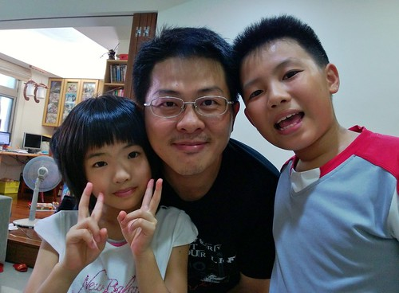
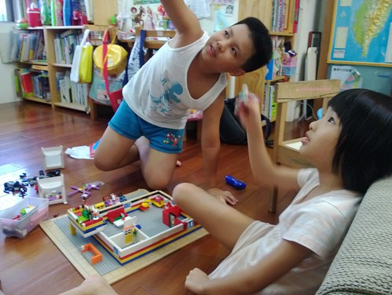
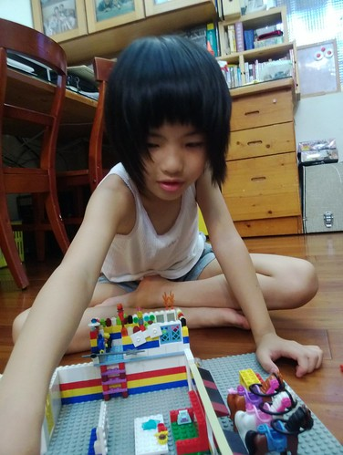
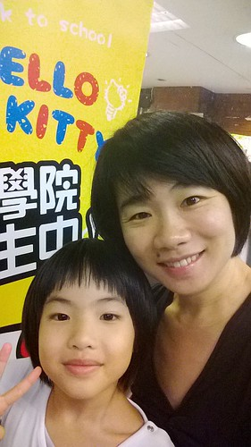
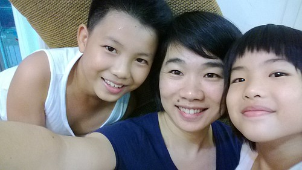
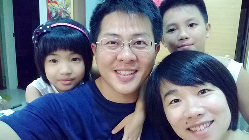
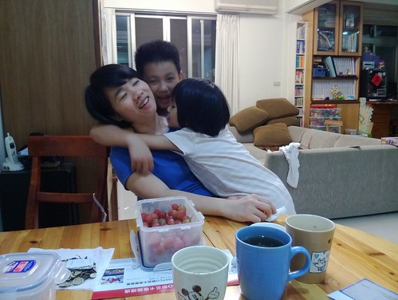
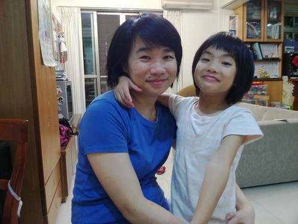

一直蠻抗拒太科技化的生活 也一直以為可以堅持下去的 沒想到突然一個轉念 我的生活也開始智慧了... 只是 當我機子的機子心裡一定很委屈  他除了只是主人的隨身相機跟上傳工具外 他絲毫無法smart! 不過對於骨子裡LKK的我來講 一切真的剛剛好 就如我堅持說 我只是迷上FB的分享生活 分享幸福! 我沒有手機中毒!

讓自己決定換手機很關鍵的原因是 母子三人逍遙跟徹爸報告時常會惹來徹爸一句"可惜 你就沒有手機可以照下來傳給我看" 加上徹爸近年越來越懶於整理照片 常累積一兩個月的照片才姍姍整理 讓需要照片寫BLOG的我 常過了新鮮 沒了寫文的FU 加上有一天 自己突然轉念想 想寫就寫 愛在網路曬幸福就曬 何必為了莫名的堅持而為難自己 因此換了隻其實骨子是相機的手機(另種說法是 手機功能很弱) 而屌的是我的門號一樣沒3G  沒有wifi一切真的就像老手機

手機買回來 徹爸比我還好奇與用功 好認真好努力的幫我這3C白癡設定好所有的手機功能 據說徹爸還在睡夢中幫我設定手機設了好幾天 (手機是window phone剛好讓徹爸這個RD好好研究一番 我這老婆也算用心良苦 )  有了新相機後 (OH~ 是新手機啦) 母子三人更是愛拍了 有時後是徹或愛跟我說 照一張傳到網路上吧  而更多的時後 當然是媽媽手癢的想拍就拍  二人  三人  四個人的自拍 全塞下了耶..  我喜歡這樣偶而來個一張 帶來的快樂感  幸福感  曬幸福又怎麼樣ㄋ~  我們是自己生活的掌舵者最重要!!! 
