徹哥想刻橡皮章已經很久了 只是想歸想,說歸說 沒有動機,沒有機會 一直沒有開始... 而為了讓要升國中的徹哥還願意跟妹妹一起去參加YMCA活力營 可以選的橡皮章課 剛好成了最好理由與誘因 就這樣徹哥的生活開始有了ㄎㄎㄎ

  開始ㄎㄎ後 徹哥開始體驗到並不如他原先想的那麼容易 但有興趣的事 願意用心 隨著一件件作品完成 成就感與更多的耐性與投入伴隨而生  七月一整個月的營隊  徹哥白天課上刻 閒暇時也刻 刻的很勤 產量也急增著 上完營隊後 我請他把這一整月刻的章一同印出 好作個紀錄 挖塞~ 真的挺可觀 而圖從下到上也顯出他刻工的大進步 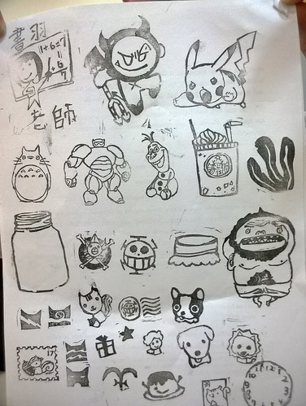 我在FB寫下這樣的紀錄: "七月徹哥跟著愛妹一起去YMCA小學級的營隊 週間每天就是遊泳,打躲避球,玩黏土,刻橡皮章 玩樂的一點都不像要升國中的人... 徹哥很感興趣的橡皮章課，爸說這還要上?想刻就會刻了阿! 媽說起碼給了他一個開始,沉靜下來刻的環境，而且有老師的引入門相信更能培養出能力與興趣! 這一個月徹哥刻的熱噴噴，產量快速累積也見証他刻功的累積 曾有位長輩說”刻這做什麼?應該也只是打發時間…” 是阿! 打發了徹哥這個沒壓力(目標)的漫漫暑假，也將打發徹哥未來人生無聊的時間! 而這不就是培養興趣的初衷..."

跟徹哥投緣 有加徹哥FB的橡皮章老師轉分享我的貼文並如是寫: "有天有徹問我 老師 要怎樣才能刻好橡皮章啊? 我說...專心! 刻章能訓練專心度! 不專心 章很容易就刻壞了XD 有徹..面有難色的說... 哇...這對我最難了... 但接著說.... 不過好像是真的. 上次刻名字時.好不容易都快刻好了. 結果..一不小心........ㄎ!! 就毀了! >< ..................................................................... 謝謝你們愛上橡皮章.. 給了這麼熱烈的回應.. 心裡真的很開心..."

我看到那句"有徹..面有難色的說... 哇...這對我最難了..." 忍不住爆笑 徹哥的專心度不足真的是最令我們擔心與責唸的 就如徹哥自己形容的 除了看漫畫跟玩樂高外 這是他難得可以這樣專心投入的一件事 可見徹哥對橡皮章的興趣真的有大 不過看見自己的進步與被肯定 我想也是很大的動力來源! 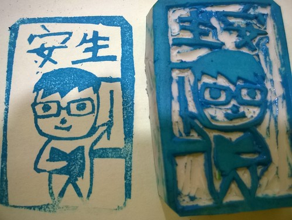 徹哥原本就喜愛的手作 小擅長的插畫式繪圖能力 剛好一起結合應用在橡皮章上 看到他把對於將出差爸爸的不捨 刻在給爸爸的章上 把久未見面但總算二年後的四年級同學會上將可見到的書書老師的期待與開心也刻在給老師的章上 我說這樣特別又客製的橡皮章 肯定每個收到禮物的人都能感受到他滿滿的祝福 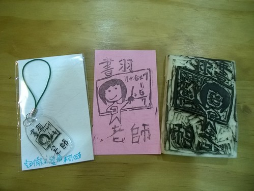 雖然徹爸笑說 看他能刻多久... 我想就算只是這個暑假初學的頭興興 起碼開啟了ㄎㄎ這扇門 且培養了一定能力 日後他隨時想刻就能刻起 這樣就也夠了!

順道一起小紀錄徹哥的七月生活: 暑假一開始徹哥列出好多想看的電影   但只實踐了全家一起去看小小兵 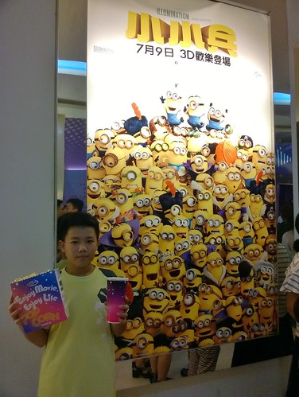 有了手機 FB帳號的徹哥 看同學打卡羨慕的很 等到自己看電影 吃大餐時 也要我們幫忙照相好事後打卡 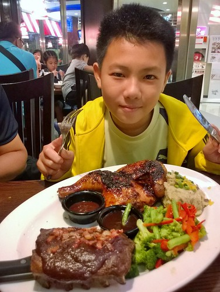 幸好他的朋友不太多 會按讚的也不多  讓他還沒沉迷/迷失在網路世界中 而我們的親子關係卻好像因為這樣的分享(tag)與網路聊天而調和 倒是出乎我們預期的挺好 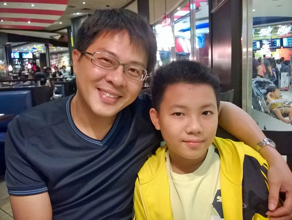

這二個月徹哥也越來越心甘情願的做我請他們幫忙的家事 從本來的倒垃圾(要等垃圾車 追垃圾車那種) 到收衣服 摺衣服 吸地板 還有有的沒的的跑腿 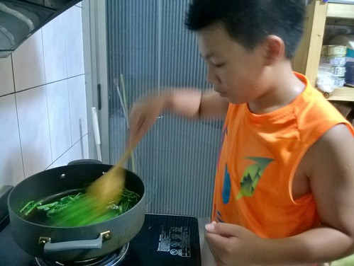 甚至嘗試著進向來最怕的廚房 學做煎餃 炒青菜 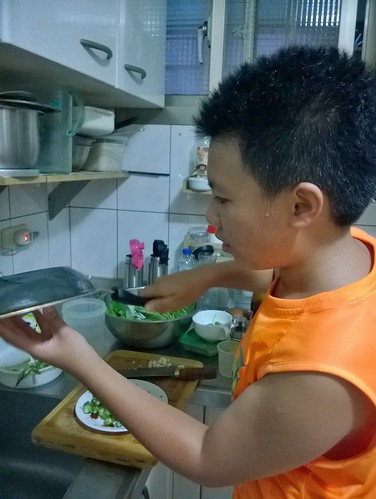 雖然次數實在也不多 但願意改變且誠意十足 就已夠讓阿母欣慰了 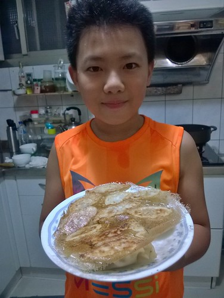 我說 這個暑假徹哥做了好多事 脾氣也越來越能控制 成就感與好心情完全反映在變柔和的臉部線條上 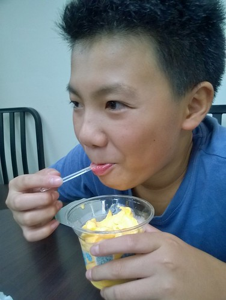 人當然看起來就也越來越帥了! 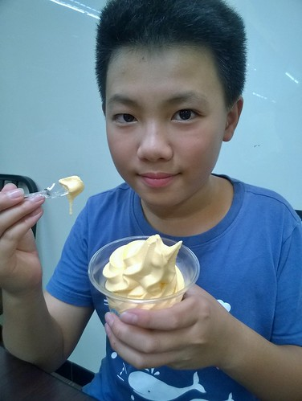 改變! 是徹哥畢業時我們送他的二字(期許) 雖然狗有時仍改不了吃屎 但看見他漸漸改變的小改變是我們所樂見... 繼續加油~
