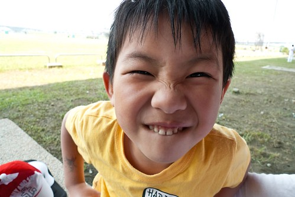
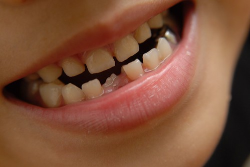
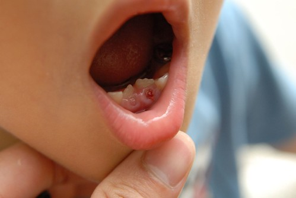
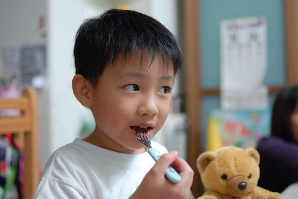

阿徹的兩顆小門牙早已經"搖"蕩了好一陣子 開始有點搖時 阿徹好開心"哇! 我是我們班男生第一個換牙的" 三不五時就用手搖著他的牙齒 巴不得牙齒趕快掉下來 問他怎麼這麼希望牙齒掉下來阿 他說"這樣子就可以有金幣啦" 他甚至眼睛發亮的說著"如果牙齒掉好多 那我就有好多金幣了"(說完還傻笑哩) 可是爸爸說"不要太早掉啦 要不然照畢業照的時候就不帥啦"

 

5/3星期日從嘉義回台北的路上 吃著御飯團的阿徹突然拿著一個像是骨頭碎的東西遞到我眼前 第一時間我還以為 哇! 御飯團裏竟然有骨刺 架恐怖…. 結果阿徹一臉得意的跟我說"我的牙齒掉了" 這時他的嘴巴裡還帶有幾絲血絲 而他竟毫不為意… 看著他那人生第一顆掉下來的小乳牙 我跟徹爸竟也跟著他一起興奮了起來…

我們笑阿徹 星期一去上學肯定會逢人就說他掉牙了 甚至還會嘻嘻的露出他那空了一個洞的牙給人看吧 我們都可以想像他那"自以為得意了不起"的模樣了 果然阿徹星期一上學時熱切的告訴了他所有的朋友 當然也跟Freda現了寶

可能因為突然牙齒那多了一個洞+長了新牙 阿徹很新奇的常用舌頭去頂 Freda根據其他小朋友的換牙經驗以及家長提供的訊息 也跟阿徹說可以多用舌頭頂那呈八字型的新牙 讓他變的整齊些

看到阿徹掉了第一顆牙後 我跟徹爸才開始上網查有關換牙的相關資訊 網路上各種說法論點都有人寫 有人說只要恆牙一長出 乳牙就一定要去拔掉 又有人說如果乳牙早已在搖晃 可以等他自然掉落即可 又有人說要避免小孩用舌頭去頂掉牙的洞或新恆齒這壞習慣... 我跟徹爸是越看越困惑了   於是決定還是提早帶阿徹去看牙醫吧 (距離原本的回診時間還有兩個月)

阿徹的另外一顆下門牙也早已在搖晃 距離"掉落"的日子應該已不遠已 本來打算就讓那顆牙自然的掉落吧 可是打電話去預約牙醫時 護士聽到"新牙已經長出 舊乳齒還在" 就很緊張(像是很嚴重的事一樣)的說"照\*\*醫師的做法 那乳齒是一定要拔的" 於是幫我們在牙醫排的滿滿的門診預約中硬是僑出一個時間讓阿徹可以去拔牙

聽到要去牙醫那拔牙 阿徹很緊張直嚷著"會怕" 我們只好苦口婆心的跟他說"新牙沒有地方長以後就容易長的醜醜了喔" 於是很殘忍的就在畢業旅行的前一晚被帶去拔牙了(徹爸還有點擔心如果去畢旅時牙痛怎麼辦) 牙醫打麻醉時 阿徹很堅強沒吭一聲 (照理說打麻藥是最不舒服的阿) 可是看到阿姨拿出拔牙的鑷子 阿徹馬上驚恐的掉眼淚大叫"不要" 結果被牙醫阿姨嚴厲的訓斥一番(那牙醫阿姨真的超有原則 超嚴厲的) 被恐嚇的阿徹(再哭爸爸媽媽就不准陪在旁邊了) 只好乖乖的張開嘴巴讓阿姨拔牙 因為牙本來就已搖晃 咻的一秒鐘的時間牙就被拔了出來 因為上了麻藥阿徹根本沒感受到牙被拔了 回家後竟然還以為他的牙還沒拔.... 我們就笑他說 最疼的打麻藥都沒唉了 不會痛的拔牙哭的哇哇叫 呵呵! 阿徹怕的應該是那些拔牙的器械吧... 有了這第一次的拔牙經驗 下回他應該比較清楚什麼叫痛 什麼時候才該哭了吧

這回提早看牙醫除了拔牙外 最主要還是想要請牙醫師釐清我們有關換牙的觀念 1. 通常每對的換牙(牙齒都是成對的換)間隔大約6個月 不過阿徹的下犬齒比較早 可能再4-5個月就會換 屆時要多留意 2. "需要拔牙"的原則與時機 阿姨說基本上恆牙新長出 乳齒最好就要拔除 不過恆牙只要在乳齒的1/2高度前拔都還可以接受 如果恆齒長的高度超過乳齒的1/2  恆齒就很難矯正回來了(因為乳齒佔據了恆齒該長的位置) 3. 有關新長的橫齒成八字型生長或位在乳齒的後方  (網路上有人說這是自然現象 慢慢自然就會往前對齊) 因為小孩的骨骼 牙齒都還在發展 牙齒生長的位置尚未定型 除非太離譜  要不基本上都會觀察到全部換好牙後(大約小四) 才能判斷牙齒是否需要矯正 4. 是否需要用外力 例如用舌頭去頂新牙 讓他長的整齊 醫師說不反對 但是效果微乎其微 反倒可能養成壞習慣

徹爸看到阿徹拔牙哭了以及牙醫嚴厲的態度有點不能茍同 徹爸說以前我們哪有上牙醫拔牙的 不都隨便讓他掉讓他長 所以他覺得以後除非長超過乳齒的1/2 可以的話就讓乳牙自然的掉落就好 唉~ 時代不同了ㄇㄟ... 如果多注意一點 多一些額外的辛苦淚水可以換來以後的一口美牙 且幫我們省掉那好些萬的整牙費用  "狠心"應該還是值得的啦!

"掉牙"讓人感覺阿徹真的又邁入另一個階段了....

對了 去牙醫拔完牙的那天晚上 阿徹跟我要了他的那兩顆牙齒放在他的枕頭上 期待有牙仙子拿金幣來換他的牙 鑒於他很可憐的被拔牙  媽媽我很好心的扮演了給金幣的牙仙子 結果小子早上六點起床尿尿時 竟然就發現枕頭下的20元金幣 笑咪咪的跟我說 牙仙子給我金幣了哩 等他7點多睡醒之後 情緒還是很high 拿著他的"金幣"跟我們炫燿 不過炫燿之後他跟我說"其實世界上根本沒有牙仙子" 我就說"哈哈~ 你也知道沒有喔  那你覺得誰是牙仙子" 阿徹就說"金幣有爸爸媽媽的味道" 哈哈~ 幸好小子還沒有天真的過頭.....
