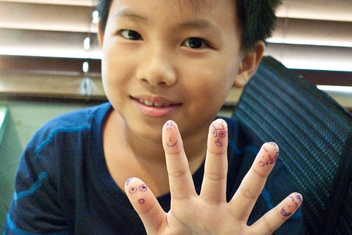

阿徹升級當小三已經一個禮拜了雖然才一個禮拜 講什麼可能都還過早 不過我很欣慰阿徹有一個好的小三開始..小三第一天的作業是要在聯絡簿上寫下今日心得 阿徹這麼寫:"我覺得新的班級好乾淨 老師好親...

沒錯! 阿徹從一二年級的張九九變成現在的張四九 看到重新編班後的號碼 我跟徹爸兩人私底下笑著'四九耶! 哈哈 還真符合阿徹三八又傻傻的個性" 開學的第一個禮拜中 阿徹每天很認真的寫著他的作業 字跡工整的讓我們忍不住驚呼'小三寫的字果然不一樣喔' 阿徹說'因為老師要求很嚴格' 沒寫漂亮的生字 老師會整行擦掉 直到過關才打勾 不過以前老師也很兇阿 怎麼現在的老師就讓阿徹這麼心甘情願ㄋ? 而且這一周裡 阿徹還每天在晚餐前就自動的整理好他隔日的書包 上小學兩年 我們從沒看過阿徹整理書包的 我們笑說' 這轉變也未免太大了!! 小三果然不一樣...' 我們很是納悶到底什麼原因讓迷糊又隨性的阿徹可以在升上小三後馬上變了個人似的?! 我跟徹爸看到班級blog裡 老師的照片後 我們說'哇 老師好可愛喔' 我問阿徹'你是不是因為老師很可愛 所以才這麼乖阿'  阿徹不好意思的傻傻笑著... 而且不知道是不是因為當午餐股長 阿徹每天中午都要服務同學 加上隔壁位置的女生剛好因為右手受傷打石膏 給了阿徹貼心幫忙的好機會 (開學第一天 阿徹提到他隔壁同學手受傷時 我就拍拍他跟他說'是你好好照顧人家 表現的機會了' 阿徹笑說 "你怎麼跟我們老師說的一樣阿 不過這是積點的好機會") 因此新老師對於阿徹的印象好像很好哩... 在聯絡簿上誇了阿徹幾次... 徹爸跟阿徹說'你一開始表現這麼好 小心以後老師發現你的真面目會失望的..' 又有一次睡前 我鬧阿徹'你竟然因為老師可愛 就表現的這麼棒..' 阿徹竟然就回我說'你也長的很可愛阿' 哈哈! 幫自己解套的同時也捧了媽媽 甜言蜜語的果然有當小三的本錢阿!! 不過 真的還蠻樂見這年輕又可愛的新老師可以帶給阿徹什麼樣的刺激與轉變...拭目以待... OS: 只怕一切都又只是阿徹的三分鐘熱度阿!
