成長是喜悅的 過程中很多的千變萬化 萬分感動 實在應該記錄下 卻也很多的百感交集 感觸萬千 讓阿母難以說起只能盡在無言中 於是每每開啟網誌編輯 然後再默默關掉... 但心頭還是一直卡著欠徹哥的十三歲生日紀錄 尤其還是升上國中 開始變聲轉大人 這樣重要的成長紀錄

若要用一句話形容阿母對於兒子現階段成長的感想 我想應該是: 雖然慢 但起碼一直有朝著正向前進中 每天(好啦! 其實大人或小人常會偷懶)我們一起努力(陪伴著)成長 期待長身高也長腦子的徹哥 慢慢蛻變成他自己的樣子~~~ 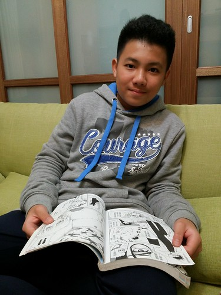

搭配照片還有FB上一些紀錄 替徹哥的七年級, 十三歲記錄下些什麼 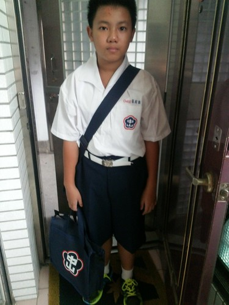 七年級的第一天，當事人的感想只有”好累”二字 不過比爸媽預期的狀況外，好很多，就算是個好的開始~ 雖然當事人又說我一開始都這樣（雄心壯志），以後就… 而13歲的男孩不愛媽媽隨便照亂亂po了，媽媽只能偷拍聯絡簿，紀念下歷史上的這一天 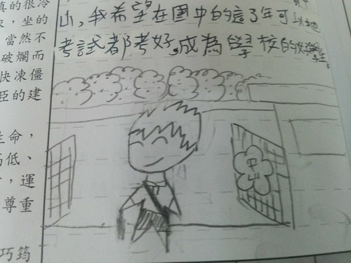 七年級生每天都在唉問“今天小日記要寫什麼” 而往往最後寫的卻也不是我們說的很多例如… 每篇小日記下的小插圖不只充版面，其實更有戲 從開學前二週到第一次段考前二週間，小圖果然很有徹式風格的down很快… [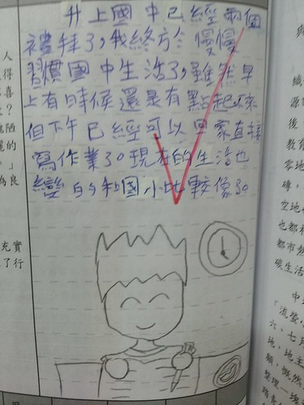](http://flickr.com/photos/33703965@N00/23255043889) [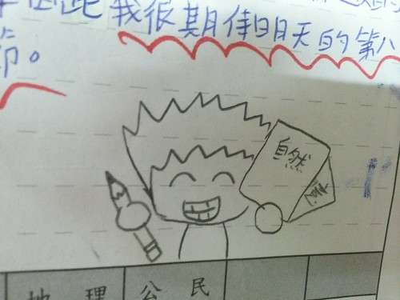](http://flickr.com/photos/33703965@N00/23514397072) [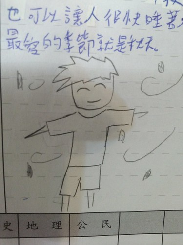](http://flickr.com/photos/33703965@N00/23514404992) [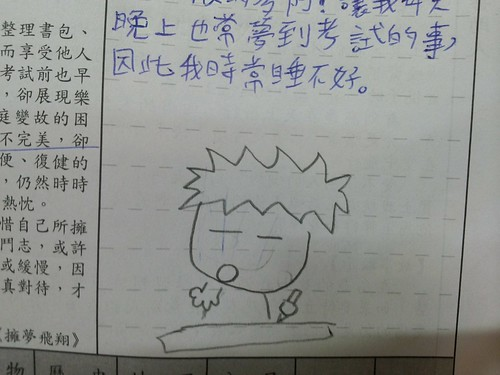](http://flickr.com/photos/33703965@N00/23514406812) [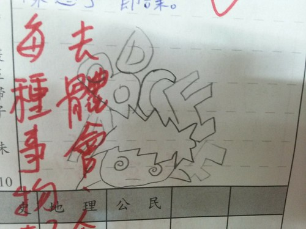](http://flickr.com/photos/33703965@N00/23514401342) [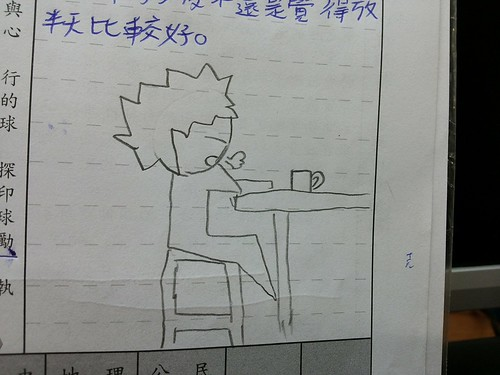](http://flickr.com/photos/33703965@N00/22995913963)[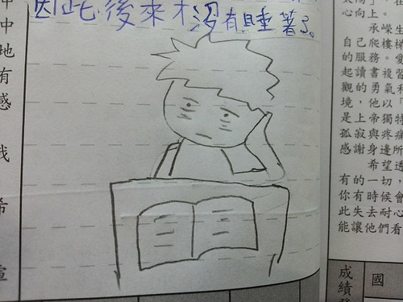](http://flickr.com/photos/33703965@N00/23540563841) [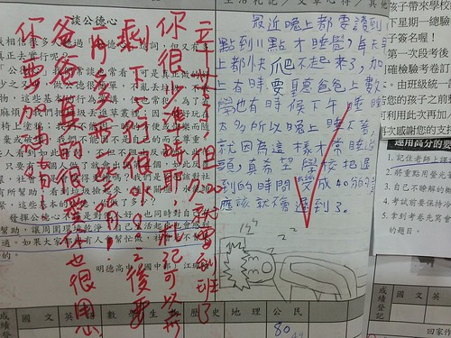](http://flickr.com/photos/33703965@N00/22995928593) 第一次段考前 的確是徹哥與我們都不好熬的一段日子 小學從沒認真過功課的徹哥(就算考試也是前一二天看個半小時一小時的書就叫準備了) 的確在升上國中後嚐到苦頭 尤其學校的傳統升學環境以及班導師的國文人標準 對他跟父母的我們來說都是很大的挑戰 會心急  但也只能要徹哥多努力 我與徹爸一直試著各種方法 一起同徹哥去適應國中課業的難度與強度 只是我與徹爸在一波波的事件中 原生家庭的觀念差異讓我們史無前例的爭吵不斷 都是為徹哥好  彼此明白 徹哥也明白 只是我說 孩子是我們養出來的(言下之意是也是我們默許他國小這樣過的) 怎樣我們也該負責任的跟他一起面對困境 處罰必需 但我相信陪伴與實質的指引還是最重要 而補習除了不適合徹哥目前的程度與唸書習慣外 也不是我們樂見的模式 所以徹爸的數學家教課每周二小時持續著 而英文則由阿母帶著帶著徹哥從第一課的每字每句讀起, 帶著一字一句寫作業 所以雖然英文一直是徹哥在班上很弱很弱的科目 但看著他從第一次小考不知所云的七分進步到可以寫出句子, 及格的段考成績 我總欣慰的跟他說 很好! 有進步耶! 而英文學習到達個階段後 要面對的累積單字就真的只能靠學生自己多努力了(這是阿母最常的叮嚀(嘮叨?))

第一次段考前的徹哥與我們真是在驚滔駭浪中過度 直到第一次段考成績出乎意外地沒有我們預期的不好 雖然平均只有七字頭 雖然班排只在2/3 但徹哥與我們都鬆了一口氣  老師也更加相信徹哥是可期待的... 我常跟徹哥說 你要慶幸自己是可以唸書的 是唸了書後可以反映在成績上的 只是念書的深度與堅持度 要自己多領悟 多努力阿 我與徹爸相信成績不是絕對  態度才是我們最重視 但成績某種程度反映著學生的學習狀況與態度 更難以想像的是徹哥後來的段考成績與學期成績都在第一次分數上下擺 只是當班上其他同學漸漸拉開後 徹哥維持在十五的名次對他來說是信心的大滋補

徹哥自己常說除了作業考試太多外 其實他很喜歡上學 喜歡國中生活 不若國小高年級時在班上的窘境 徹哥喜歡現在的班級 喜歡他們班有著各式各樣厲害的 奇怪的人 更令他喜歡的是 現在有可以開心聊很多事的同學 (青少年的認同感阿) 而我們感到欣慰與幸運的是 徹哥身旁圍繞著一群好孩子 會分享漫畫 會天真的聊天打屁 也會盯徹哥作業 傳授讀書方式 我欣慰過去十三年 起碼我把徹哥養成善良 正直的孩子吧! [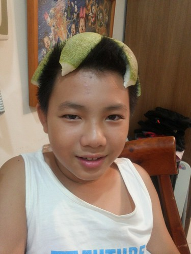](http://flickr.com/photos/33703965@N00/23597386146)

上國中後 除了有感受到徹哥對於課業學習態度的漸漸改變 情緒上的控制也進步著  算是有渡過青春期的彆與拗 雖然還是大辣辣 但是暖男無誤 (幫阿母設計的中秋節小卡) 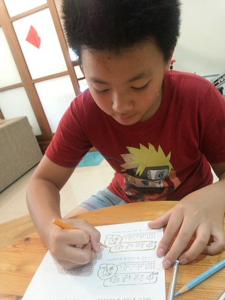 讀書的日子很充實但真的也有苦悶 徹哥更珍惜可以做東做西的休憩時間 [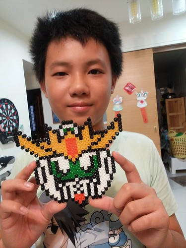](http://flickr.com/photos/33703965@N00/23623467535) 這二年很迷鋼彈阿  床頭都有一大排的鋼彈廟了 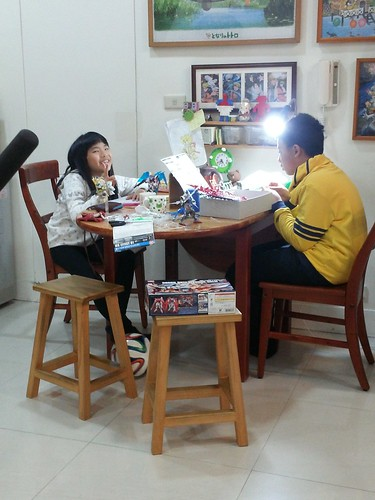 徹哥說這些鋼彈守護著他 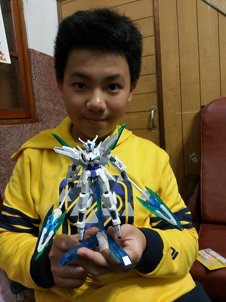 除了聯絡簿日記的插圖外 徹哥的課本本子 卷子上也常見到或是打發無聊,睡意的小圖 而這一年有了夢想的徹哥 立志要當漫畫家 所以持續最愛看漫畫外 也看教動漫的書 三不五時也臨摹喜歡的人物 而畫動漫也成了他在班上交朋友 被看重的利器  除了自己的興趣外 徹哥也不若高年級家庭旅行時常常的臭臭臉 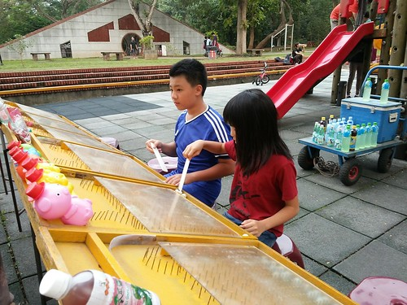 喜歡回嘉義時的童趣 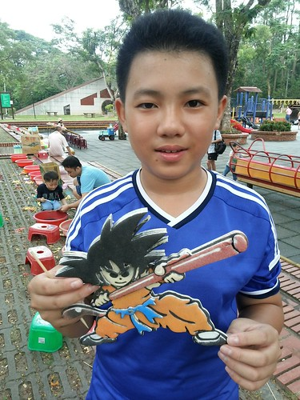 喜歡阿母帶著去郊外走走  去看電影 這半年 我們一起去看了好些好電影 好電影 讓我們一起感動但各自領受在心 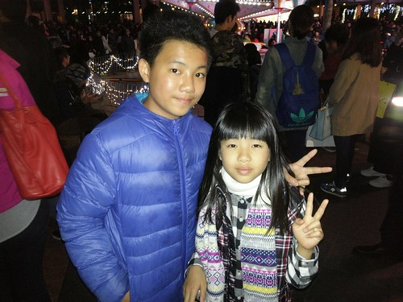 身為青少年的好胃口 當然持續著 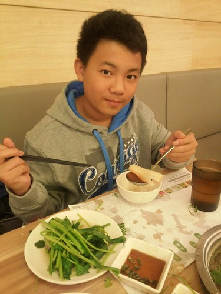 每天都是永遠吃不飽的餓小孩 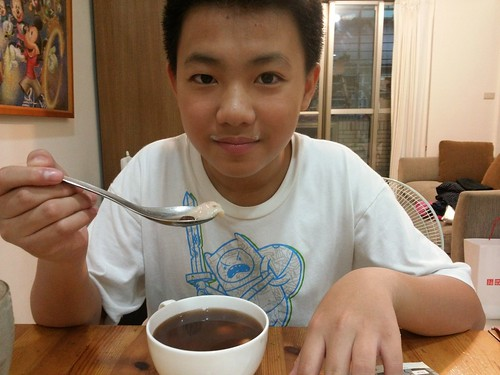 是媽媽的最佳捧友 永遠大快朵頤般的吃光食物 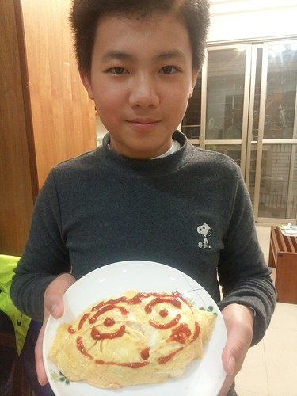 身為親少年 最大的改變與特點當然是會愛漂亮了 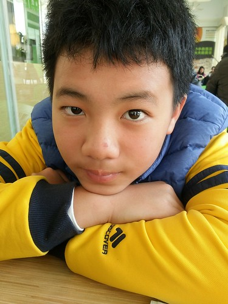 喜歡帥帥的樣子  只是那個很多又會捲的頭毛讓他常被同學開玩笑(同學很愛摸他的鳥巢) 令他有些難過又莫可奈何[ 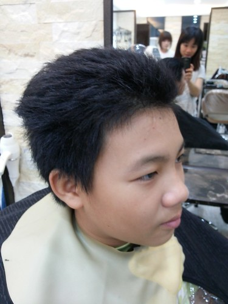](http://flickr.com/photos/33703965@N00/23597386146)話說小孩十歲後 照相都不露齒笑了 甚至不愛笑 我總跟徹哥說 你的笑容多迷人 不笑多可惜 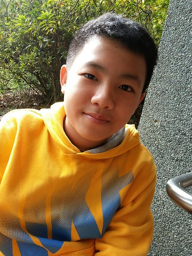 而讓徹哥比對過笑與不笑的照片差很大後 現在徹哥照相時的笑容雖然還是淺淺的但很迷人 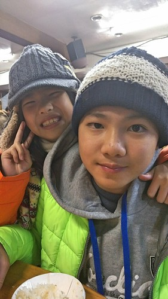 除了笑容外 我想漸漸有的自信光彩也是讓少年迷人的要素之一 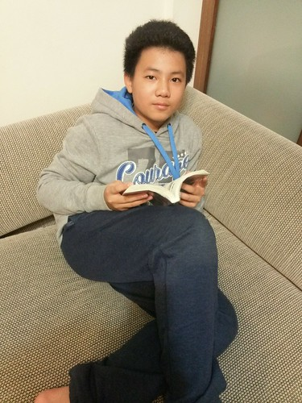 到底脫繭而出會飛出什麼模樣的蝴蝶不知道 但我們拭目以待毛毛蟲的銳變... 而雖然已經是在外人前不給阿母牽手的少年了 但永遠是阿母長阿母短 每晚跟阿母親親抱抱說晚安的小男孩阿~ [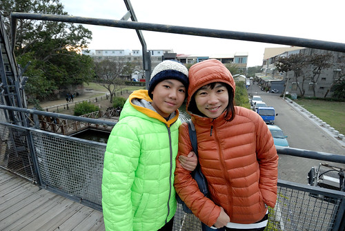](http://flickr.com/photos/33703965@N00/24730256949)
