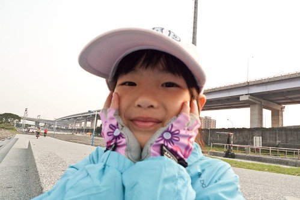
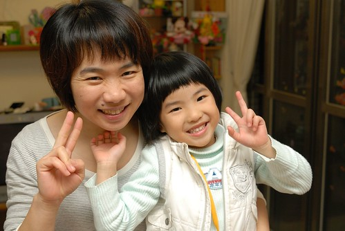

三月的溫度雖然仍起起伏伏時寒時熱的 但感覺愛愛的三月已是大地回春另具一番氣象了... 二月底三月初趁著天氣好的假日跟著徹爸實際上路騎車到華江河濱自行車道 才兩次而已技術與耐力卻跨了一大檻 且一次次的更加進步令人欣喜... 而她嚮往許久思考許久的剪頭髮 也在她某天突然下定決心且意志堅定的要當短髮公主後改頭換面了 雖然越來越有主見的姑娘略有愛生氣的惡習  但三月好多的事情讓小姑娘常有著好心情 從早說到晚笑到晚 連上學路上被她打招呼的叔叔阿姨都也感受到她的好心情 聽著她充滿活力的聲音 看著她開心的笑容 大家忍不住也笑孜孜.... 

鑒於愛愛的體重逼近徹爸單車後座椅的承重上限 我們開始積極的想要訓練愛愛騎車上路的技術與耐力 228從嘉義回台北後的下午沒事 徹爸吆喝了愛愛一起出門騎車吧 愛愛沒有拒絕返到興高采烈的跟著爸爸一起出門騎車去 從家裡出發順著萬板路到萬板橋外的堤外 雖然沿途人車不多但這段路也快2公里 爸爸說這裡是練習上路的好路啊 甚至還比堤外安全ㄋ 因為堤外車到高手如雲 根本懶得躲這種小娃 可是對小娃來講其實很危險  

在家裡跟阿徹耗著的我(阿徹不願意出門 媽媽只好犧牲在家了 其實好羨慕徹爸可以出門的)一直注意著時鐘 想著愛愛可以騎到多遠 可以撐到多久... 結果愛愛很出乎我意外的騎了一個半鐘頭才回來 而且還真騎到堤外去了 徹爸說若不是因為跌倒了 愛愛說不定還可以騎的更遠ㄋ 真棒! 第一次出征能有這樣的表現 我跟徹爸就已經超開心的 猛親著愛愛說"你好棒阿!" 

隔天看到徹爸上傳到FB的愛愛騎車照片 我留下這段話: 2/28在徹爸的伴騎下 愛愛騎著她的小12吋從家裡(民生路)到萬板橋的堤外 短短3公里的來回卻是愛愛的大突破...第一次上路耶 (更正後來爸爸查map 總共是4公里多一些) 回來後愛愛說腳好痠 手好痠 但是笑的好開心 晚餐也難得的好胃口 吃到打嗝 而九點上床睡覺時也是不到3分鐘呼呼睡著.. 真喜歡看到這樣運動後好心情好胃口的健康小女孩 

隔一週六 愛愛又跟著爸爸去騎車了 這次出門愛愛依然穿上她心愛的牛奶褲(牛仔褲啦) 且自己要求要戴安全帽 

這回又更厲害了 延續上回的路線過了華江橋下  順著車道來到大漢橋下 然後再騎著民生路回家(十字路口車多就由徹爸牽車 愛愛走路)  總共騎了6公里多 這真是太令人振奮了!!! 希望持續下去 有朝一日可以一家子四口人一起出門騎車趴趴走阿!!! 

換來說說換髮型這件事... 從我去年八月剪短髮後 愛愛就一直羨慕我是短髮也嚷過好幾次她好想剪短喔 甚至有次還有點生氣有點難以理解的跟我說"不公平 為什麼你都可以剪短髮 我都不行" 可是因為小孩夏天短髮太赤燄 而且鑒於之前愛愛短髮長長後那澎的像豬哥亮的模樣 其實我是比較愛她的長髮造型的 而且一直用各種理由阻止/說服愛愛的 而愛愛其實也很喜歡長頭髮的樣子 尤其穿上裙子皮鞋後還真真以為自己就像是那公主了 只是過完年後 愛愛又開始很認真的跟我說要剪短髮 我說"4-5月就要音樂發表會了 短髮就不可以用包包頭了 長髮用包包頭就像漂亮的小舞著了" 雖然愛愛講了誰誰誰也是短髮 但幸好還是被我又緩住了 愛愛說"好吧 那就等6月再剪 到時候我一定要剪喔"

每次在討論這話題時 徹爸就會說我覺得短髮很可愛阿(徹爸蠻喜歡愛愛以前的短髮的) 這時候我就要趕緊補充說"可是長髮是漂亮 可愛跟漂亮你想要哪一個" 想不到2月底的某一天洗完澡後 她一臉堅毅的跟我說"我決定了 我要當短髮公主" 那語氣讓我覺得她真的想通了 她想出自己的一套思維了 就是短髮也可以是公主 突破這點 剪短髮就不是任何問題了 因為還是可以是公主啊! 愛愛甚至還學我以前說的話"反正頭髮再留長就好啦 又沒有什麼" 嗚嗚嗚...是阿...再留長就好了 而且愛愛留頭髮的速度又超快.. 被她的堅毅與樂觀所"感動"的我再沒有任何理由可以阻擋她了 也不想阻擋了 於是愛愛的頭髮就這麼喀擦的給剪下去了!!!

看短髮前 先來回顧一下愛愛長髮飄逸的模樣: 穿上澎裙真的秀氣的就像個有靈氣的好公主 

即使在家一頭亂髮也是頗具女人味阿 話說愛愛真的不愛綁頭髮 也覺得長髮洗頭吹頭超折騰 

簡單的匝個馬尾巴是我跟徹爸最喜歡的髮型 尤其愛愛那圓呼呼的頭形超適合 ( 戴上媽媽眼鏡 哇賽 變的跟媽媽一樣有氣質了) 

每天早上要上學前 母女兩人的對話常是""今天要綁什麼 一隻 兩隻?" 一隻就是像上面那樣 兩隻就是這樣  時間多點的話頂多再多繞個辮子 

去年這時候連馬尾都綁不起來 今年就已經可以這麼長了  營養大概都跑去頭髮上了 

3/5去找阿姨剪頭髮時  阿姨也一再確認真的剪了嗎 真的! 就給他大刀闊斧的剪下去 反正都要夏天了 短個夠更涼快

先沖水 

然後動刀... 過程中愛愛一直用著有點害羞有點興奮的眼神及嘴角看著鏡中的自己 

噹~大致模型出現 

阿姨說兩側頭髮有自然捲加上頭髮綁太久髮流不太順 她不能夠接受一顆美美的頭就這樣壞兩邊(阿姨超讚賞愛愛的頭型) 於是幫兩側頭髮上點藥水(簡單的離子燙) 

等後藥水後沖水 (今天總共沖了3次水) 

然後夾一夾頭髮 再上一次藥水 總共歷時1個小時多些 小女子都沒有不耐煩超配合 

噹噹噹~ 新髮型出爐~ 

一頭輕盈的愛愛超級開心的啦! 

而且這樣就跟媽媽一樣了 

只是剪短髮後的愛愛不只看起來不一樣了 怎麼剎那間整個人也狡猾頑皮了起來 唉...到底短髮好還是長髮好 這永遠是困擾女人的難題啊! 不過媽媽我真覺得頭髮是最能變化的東西了換個髮型換個心情超級棒! 所以恭喜愛愛成為短髮公主嚕~ 

短髮公主最近似乎好像真的又長大了 很愛要幫忙家事也漸漸可以幫了 烤pizza那天 上面的料都是兄妹倆聯手完成的 

連煮玉米濃湯時也是她有耐性的拿著打蛋器攪拌避免黏鍋 (哥哥攪個一圈就飛走了) 媽媽很期待以後是個得力小助手喔! 真好~ 

還是自己家的pizza料好實在又美味阿! 讚讚讚!!! (炫耀一下 真不好意思) 
