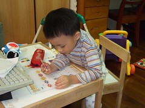

之前一直覺得小愛有點憨憨呆呆的  
跟徹爸還很愛叫她作"呆呆妹"  
阿徹哥哥甚至還幫妹妹取過這樣的綽號 "豬頭妹" "豬頭小公主"  
但最近覺得小愛似乎開竅了  
常可在她臉上 眼神裡看到過去阿徹哥哥的賊樣  
也許因為這樣 很多人說兄妹倆越大越像了

曾經跟徹爸慶幸說 幸好阿徹是老大小愛是老二  
因為阿徹從小就很皮 屬於難帶難搞型的小孩  
而妹妹相較之下OK許多 算是由儉入奓吧  
假若小愛是老大而阿徹是老二的話  
我想我跟徹爸有可能會被搞到抓狂

雖然小愛大部分的時間還都是小甜心的模樣  
但是越來越愛玩了  
也越來越不怕死 不怕摔 不怕痛的探索環境  
越來越有主見也越來越懂得堅持  
當然跟我們間的衝突也就越來越多  
哥哥正在玩正在看的東西都想湊熱鬧  
如果不依她也會臉趴在地上哭泣  
甚至會像企鵝般的趴在媽媽大腿上來回翻轉  
ㄘㄟ~有點耍賴  
不過小愛還是有比哥哥長眼點  
愛玩不想睡時就自己一人乖乖的去玩  
哭鬧沒人理會識相適時的收起眼淚  
小愛乖乖阿~  
千萬不要像爸爸媽媽哥哥這樣固執還脾氣不好  
你可是我們家的小公主 小甜心喔~

看到哥哥寫字也硬要一份

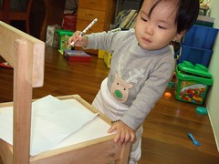

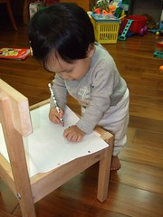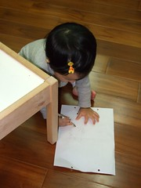

玩飛碟台

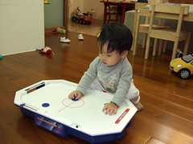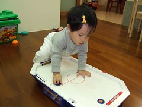

小鬼臉小賊樣的模樣

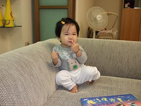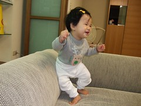

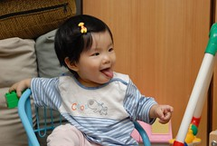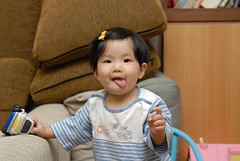

不睡覺玩到大書桌上

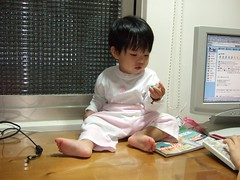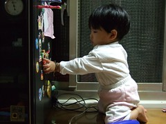

很愛把櫃子裡的書 玩具掃落一地 還得勞動爹娘幫他收拾

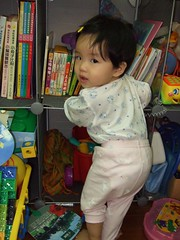

常常是這樣玩玩具的 (第一次放手站立玩玩具)

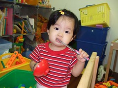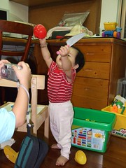

也懂得這大沙發的舒服了

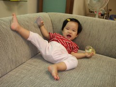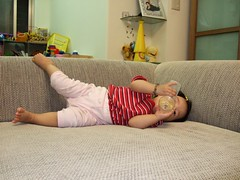

爸爸吃飯時常像小狗般的去乞討食物 拜托主人賞他一口飯吃

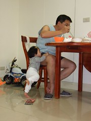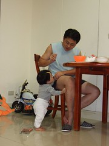
