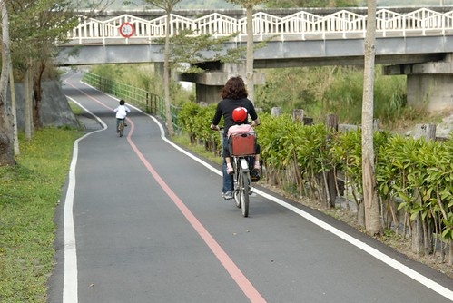
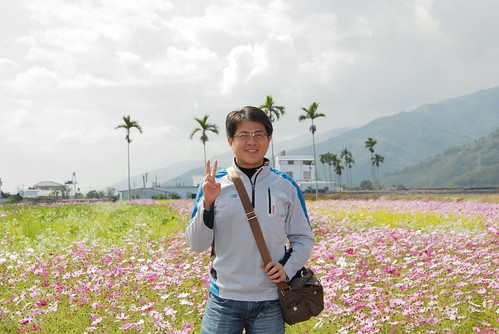

再不寫這篇真的就又要擺更久了.......................

一月的花東行帶了阿徹去關山朝聖  朝聖什麼? 朝聖全國第一條環鎮自行車道 網路上對於關山自行車道的介紹如下: " 關山環鎮自行車道是全台首座自行車專用道，係配合環保親水公園興建，車道全長12公里，寬3~4m， 途經清流的水圳、檳榔夾道的小徑、桃花心木濃 蔭下的公墓，結實纍纍的香丁果園、幽靜涼爽的台灣櫸木林， 以及景觀隨四季變幻的寬廣稻田，從這兒可以眺望一覽無遺的小鎮風光， 只見阡陌 縱橫的稻田與錯綜複雜的灌溉溝渠，交織成一片純樸優美的畫面 "

真的覺得關山自行車道不只是第一也是最好最用心 很適合全家共騎喔~ 去台東玩的人 有機會可千萬記得留個半天去關山朝聖一下 保證不虛此行... (不過日頭赤炎炎的夏天就不建議這麼做了 要不然好歹也是得3-4點太陽小些 )

關山鎮上腳踏車出租店很多 也大都集中在入口前的路上 各家店的服務人員都極熱情賣力的在門口對著每個路過的遊客搖旗招喊 所以就找家看的比較喜歡的 進去挑台適合自己的車 就可以花個2-3小時來趟小鎮自行車巡禮

車道的起點就在山水軒渡假村旁 (我們很喜歡的一家渡假村) 只要能找到這起點接下來就不用擔心迷路了 因為沿途都有很詳細的路標指標引著 

經過檳榔小徑後便是這一串的門廊小徑 雖然花樹應該是一直不能如預期的茂盛遮陰 但這樣卻又是另番的風味 

(翻出3年前第一次來關山時的照片 一次好好加油添醋個夠 ) 

經過這裡 運氣好的話可以看到在藍天白雲下起飛的輕航機  煞是美麗 

車道的前半段主要就是順著水圳而行 沿途欣賞稻田風光 而突然冒出的一棵大樹又更增添另番美麗 (徹爸很喜歡這種FU) 

沿途道路的柏油鋪得很好也沒有坑坑疤疤  維護的很不錯 

1-2月時節還可以看到休耕稻田裡盛開的波斯菊花田或油菜花田 

藍天青山花海 簡簡單單的舒服 

小孩騎車累了 下來看看花踩踩花便又神采奕奕精神飽滿嚕 

雖然是冬天 可是太陽曬久也是讓人汗流浹背低 (除非寒流來襲 到台東真的不用帶太多厚重的衣物) 

美麗的油菜花田 

油菜花+波斯菊花 拼湊出黃黃粉粉的美麗顏色 這便是最自然最美麗的畫布啊 

既然是環鎮當然會有一小小段的山路 

騎在兩旁樹木扶疏的山中又是截然不同的涼爽愜意 

車道的中點也是車道的最高點 在這裡有驗票/補票亭得下車驗票 關山環鎮車道是全台唯一收費的自行車道 可是能有維護如此良好的車道 這樣小小的收費我們認為很合理也很值得 

在這裡坐在涼亭小憩一下 

還可以盡覽關山風貌 (可惜那時候正是準備插秧前的準備 大部分的稻田都是黃黃土土的) 

過了驗票亭後便是連續一公里的下坡路段 讓人輕鬆的哈哈大笑 

這一年有騎車有差 上回來騎的有點辛苦 這回就算車依舊難騎可是輕輕鬆鬆 

雖然只有12公里但也別急著要完成  慢慢騎慢慢享受 

而還不會騎車的愛愛只能騎這種假裝的過過乾癮 

小妮子不知道會不會很期待自己可以獨當一面騎車 

途中亦會經過幾處草莓田 時間不趕的話便停下來採果吧 

雖然草莓田不大 

草莓也不是很大顆  但很紅就是甜的保證嚕 

阿徹小愛很愛吃草莓 採草莓更是開心 

而採完後洗一洗 一顆一顆的送入口中  過癮啊 

環鎮車道的後半段本來會經過下面這些地方  但這回去車道的後端已經因為安全考量截彎取直 很快的就切回去親水公園段了 所以下面這幾張照片都是3年前拍的   下面這段路我跟徹爸覺得很漂亮的說 

就說吧 徹爸特喜歡這種道路旁一棵樹的FU 

以前有機會的話還可以跟一旁的火車競賽喔 

還可以經過住宅區 體驗農家住宅 

現在截彎取直的路段就跟車道前半段一樣 順著水圳而行 雖然安全平坦但就是少了一些不同特色的體會 很可惜 不過水圳上吃草的水牛卻也讓人仿若來到塞外或者說是回到農耕的時代 覺得這樣一張照片不真實的讓人覺得就像是一幅畫 而不是自己現在眼睛所看見的 

回到鎮上後 我跟阿徹小愛直接在親水公園裡等著徹爸去鎮上領便當(途中先打電話訂了) 而英猛的徹爸還多騎了好多路找7-11買多多飲料犒賞大家   給爸爸拍拍手~ (這回賞油菜花行中看到最茂密的花田便是在關山鎮上的這兩大片 水~) 

騎車累了 加上關山米的池上便當真的好好吃  大家的胃口都很好 

YA! 這就是徹家式的旅遊方式  簡單的平凡幸福味道 

吃飽飯有力氣了 兄妹又玩起123木頭人的遊戲 

能在這片大草坪上玩123  我覺得那也是給她們最棒的旅行禮物 

關山環鎮車道總共12公里 為了安撫坐在後座無聊的小愛答應讓他每到一KM的指標便給她一個Pinki糖 因此小愛開開心心的期待每一公里 每一顆小糖的到來(這就是旅行中騙小孩的小技倆) 阿徹說他也要比照辦理 但是他把每顆糖都先交給我保管 他說他要等騎完後一次吃10幾顆糖  每講到這他就開心的笑到口齒不清 總算這一刻到了.............大家可以感受到阿徹那得意的笑意嗎?! 

吞啦~  問阿徹好吃嗎  阿徹說好好吃 好過癮~~  呵呵~ 
