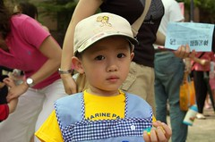
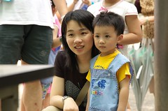

真快 阿徹上學滿一年了  
雖然這一年來最大的"問題"&缺點即是生病感冒不斷  
總的來說阿徹算是喜歡上學的  
上學讓阿徹的生活多采多姿

當初找幼稚園時  
離家近是第一考量  
再來就是考量可以讓阿徹每天玩的高興且注重生活教育人格培養的地方  
阿徹的幼稚園名叫"晨暘遊戲學園"  
沒有一般幼稚園常見的"蒙特梭利" "美語"...等字眼  
還記得當時我問了她們園長"學校採哪種教學方式 蒙特梭利或啥挖溝熟的"  
園長認真的想了想說"沒有 如果有的話那就是開放教學 "  
"讓小孩子能夠盡情表現自己 每天玩的髒兮兮的也無所謂"  
聽到她這麼說 我心想"就是這裡啦"

這一年來 阿徹的語言從當初的單字表達到現在的偶而給他爹娘"勞個"英文歌曲或單字  
我跟徹爸只能互相勉勵自己"認真多賺點錢培養兒子阿"  
阿徹真的是個充分表達自己意見的小孩  
不只在家裡機哩瓜拉的不停  
老師說在學校也是都充分且快速表達自己的意見  
課堂進行中常常認真的聽著老師說然後發表自己的看法  
常常話夾子一開就停不下來  
有時老師必須適時的請阿徹停下來讓其他小朋友發言  
但阿徹卻又馬上融入同學的發言中  
跟著同學又一搭一唱了起來  
呵呵~真的是給他很愛講話

別以為阿徹都是這麼活潑自信的喔  
對於陌生的環境空間或是活動  
阿徹卻是拘僅的嚴重  
有一次學校去湯姆龍遊戲館戶外教學  
小朋友看到那麼多玩具當然是興奮的衝阿衝嚕  
阿徹卻是一臉嚴謹 面無表情的看阿看  
等到觀察好一陣子才願意去玩  
而且他認為危險的玩具是打死都不願意去嘗試

上各週末學校在公園辦園遊會  
總算親眼目睹阿徹的拘謹  
原本開開心心 蹦蹦跳跳的走到公園  
一看到各式的闖關小遊戲  
臉就變成這樣啦~

沒說不玩但就是需要我們的陪伴  
重點是 后~那個表情有夠冷的  
14關費時100分鐘玩下來就都這表情  
只有偶而放鬆一下下露出淺到不行的微笑  
小子~ 你到底是在觀察還是在害怕阿  
太深不可測了 連你娘也搞不懂你的心理  

這是阿徹的老師 很棒的老師

更多園遊會照片請見 [http://www.flickr.com/photos/hmchen0328/sets/72057594129637838/](http://www.flickr.com/photos/hmchen0328/sets/72057594129637838/)
