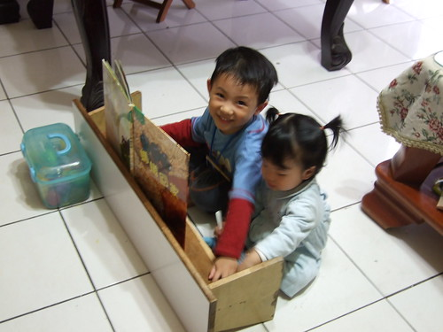
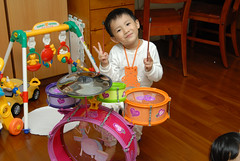
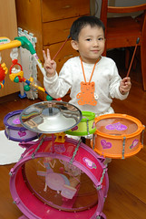
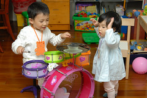
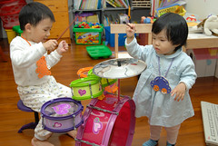
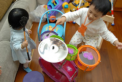
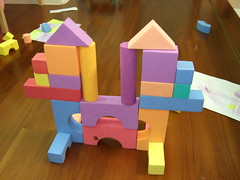
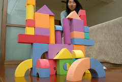

(上週五午休花了半小時寫好這篇的文字 結果按下儲存按鈕後網路要命的當了...  
  天ㄚ...媽媽最近很詞窮 好不容易生出來的東西竟然就這麼不見了 很想打人....)  
  
有時候真的不得不佩服阿徹的想像力...  
上上週末在陳嬤家時 阿徹突然興沖沖的跑進房間說要拿書彈剛琴  
鋼琴?哪來的鋼琴?  
好奇的跟著阿徹後頭來到客廳 看到地上被橫躺的矮長板凳還一頭霧水  
看到阿徹坐在板凳前方 打開書 架好圖畫書在板凳上  
然後兩隻手認真的在板凳上移動敲打  
還搭配嘴裡哼出的 so la la me do do...  
(事後徹爸看DV動畫一耳就聽出阿徹在哼小蜜蜂  音樂細胞不佳的媽媽真的有點遜)  
才赫然醒悟原來這就是阿徹的鋼琴ㄚ...  
看到阿徹這麼快樂的彈著阿徹牌鋼琴   
一旁的阿瑜哥哥與小愛也爭相排隊想要彈阿徹牌鋼琴  
不過這樣的琴還是只有發明者本身彈的最怡然自得了   

第一次集滿了12瓶奶粉瓶蓋可以換玩具  
跟徹爸煞費苦心的討論思索後決定換個玩具鼓給阿徹敲敲打打一番  
過年前即已領回的鼓 因為時近過年及阿徹生日所以先被藏在衣櫃中(但還是被阿徹給撇見一兩眼)  
最後生日禮物因故被無限期延後購買  
阿徹更是三不五時打探小房間裡玩具的消息  
"我好想知道那是什麼" "我最近很乖可以玩小房間裡的玩具嗎..."  
一直以為阿徹只知道那是玩具  
直到前兩周跟阿徹複習對話"what do you want to be?"  
阿徹說"I want to be a drumer" 接著又說"所以我要多練習"  
我說"那要怎麼練習?"  
阿徹說"小房間裡面不是有嗎..."  
ㄘㄟ....赫然發現原來這小子早知道房間裡藏的是鼓 虧他還可以隱忍這麼久  
基於不澆熄他夢想的熱情(哈 對於正值叛逆難搞期的阿徹來說 這是個難得媽媽可以給玩具的好藉口)  
於是就把原本也無限期被冰放的鼓給搬了出來   
兄妹倆開心期待的看著爸爸組裝  敲敲打打....  
  
   
  
看到哥哥打的這麼開心 妹妹也鬧著要一根鼓棒  
   
  
可是哥哥覺得一根鼓棒實在敲打的很不過癮 最後還是把給妹妹的那根給拿了回去  
於是爸爸拿了愛的小手給哭哭的妹妹充數  
然後妹妹也有模學樣的要跟哥哥一樣坐在椅子上敲打  
只是哥哥敲打動作太大 妹妹被逼的怎麼都喬不好位子  
妹你還是等哥哥熱情過後再來吧~  
   
  
阿徹偶會心血來潮的搬出泡棉積木或是樂高積木蓋城堡  
也偶會有令爸媽讚嘆"又長大了"的作品出現  
這次的城堡 論結構 對稱性 美感都很不錯喔~ 給你蓋五個章~讚啦~  
(左:施工中 右:最後成品的正面)  
  
   
  
總算又花了50分鐘寫完 筆感完全之不見...寫的小痛苦...
