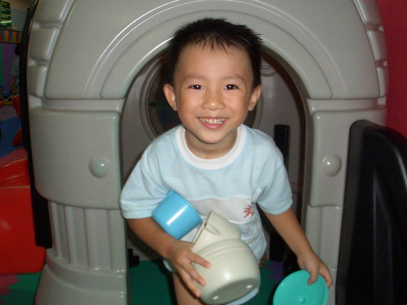

前幾天徹爸上阿徹學校的網站要看最新戶外教學的照片時  
才赫然發現學校也把照片上傳到Flicker上了  這真是個好消息阿~~  
雖然每學期末學校都會發回學期中任何有阿徹身影的照片回來  
但能夠下載保存(而且是及時的)家中寶貝的照片檔案  對父母來說都是件開心期待的事  
只是學校打從五月就開始用Flicker  已陸續放了一千多張的照片  
如今要從這堆照片中逐一找出任何有阿徹身影的照片  
為娘的真的差點沒看到脫窗 (乾眼症狀應該絕對加重)  
不過能讓美賢姨  佩姨  諸家親朋好友們一窺阿徹的在校生活   這點小辛苦算什麼ㄋ...  
  
真的覺得阿徹的上學生活蠻多采多姿的  
有音樂課 體能課 美語課  畫畫課 各式各樣訓練手部肌肉的勞作課   
每月還有老師的戲劇表演  慶生會  戶外教學 (真的每個月都帶出去一次 行程小至公園 大至新竹桃園)  
真的比媽媽上班的日子有趣多了  
有時候阿徹嘟嚷著不想寫功課時 我都忍不住跟他說"那我們交換 媽媽去上學 你去上班好了"  
呵呵...其實也知道唸書真的不是件輕鬆的事    
但上學絕對是件幸福的事~~~  
很多人聽到阿徹從2歲就開始唸幼稚園都會笑說"唸到老油條喔"  
但看到阿徹這麼一路過來 我真的覺得這油條還不老耶  
還是可以批哩啪啦越炸越香越可口哩  
  
(摩奇堡戶外教學)  

每年端午節的划龍舟大賽   
雖然船身很簡陋的是用書面紙摺的但爸爸有用膠帶加強  很穩健沒翻船喔  
  
  
  
端午節包粽子  
為了帶兩片粽葉到學校 媽媽得花數十元買一把粽葉 剩下的往往放到"生菇"  ^ ^''  
  
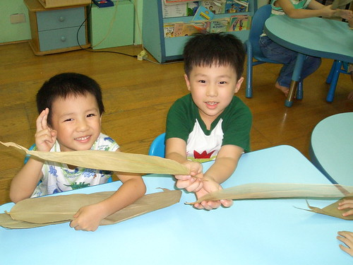  
  
拿著奇形怪狀的粽子 大家竟然笑的這麼開心  
尤其拿著兩顆粽子的阿徹更是難得的笑到眼睛一條線  
阿徹念的是混齡班  這四個就是班上一起的小蜜蜂(現在一起又變中蜜蜂了 聽說有多一隻加入了)  
小個子的阿徹 不講人家大概很難想像他跟其他三個是同年紀的  
ㄚ~~~身形怎麼差那麼多阿~~~  
偏偏阿徹在學校飯吃的比別人多又快 湯也舀的比別人滿  水果也挑最大塊  
你說我這當媽的會不會噢....  
  
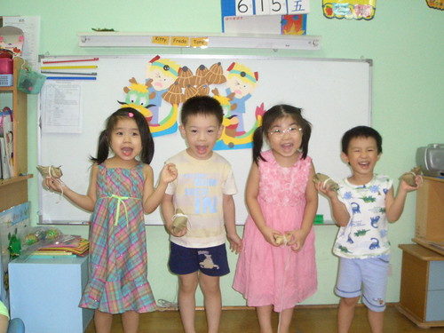  
  
母親節製作的母親節禮物  
右邊是阿徹口中的好朋友名單中唯一的男性 yellow (園長兒子)  
  
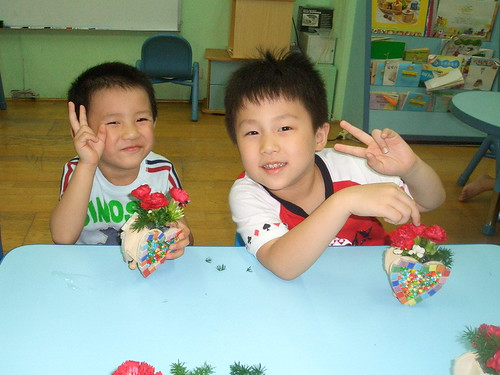  
  
不知道這網子是要抓昆蟲還是要捕風  
亦或是當風箏玩ㄋ...  
  
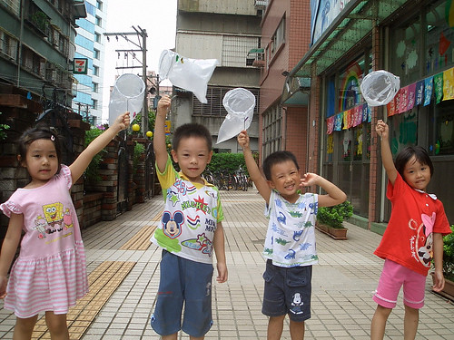  
  
阿徹畫的美麗煙火  
  
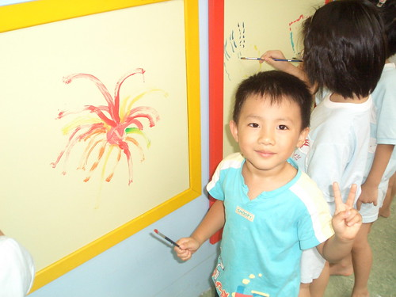  
  
資優數學課程   
學了2年多 阿徹還是分不清1-10 ( 6 / 9 不分)  
當媽的除了笑還是只能笑...  
  
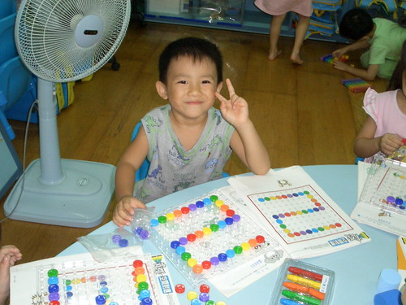  
  
中秋節賞大大的月  
  
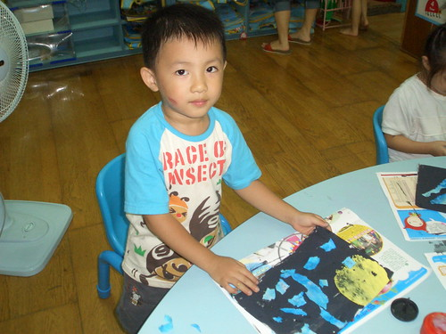  
  
上午美語課程的拼字  
聽說阿徹常一開始都兜阿兜 非得老師恫赫才會認份的拼出來   
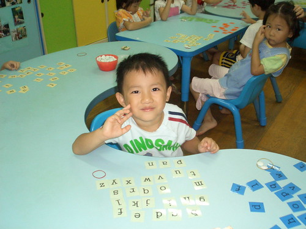  
  
音樂課  
右邊那位應該是班上唯一的小蜜蜂   
聽說小蜜蜂第一天上音樂課時 因為沒上過音樂課不知道樂器去哪拿  
阿徹很好心的帶著小蜜蜂去拿 還拉開椅子教小蜜蜂坐下  
此後的音樂課兩人就都坐在一起 阿徹這中蜜蜂對小蜜蜂照顧有佳  
  
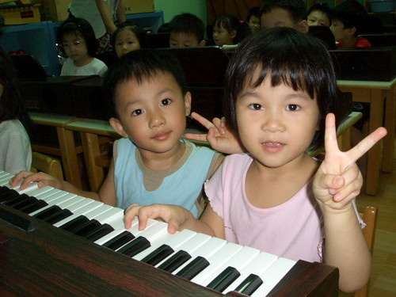  
  
體能課  
阿徹剛上幼稚園唸幼幼班時 每次體能課都是哭著緊趴在老師身上不願意下去  
在有一次徹爸授予老師膽量"就給他下去後" 情況總算有了改善  
現在玩的可瘋了 每週都期待週三的寶貝日 週四的體能課  
  
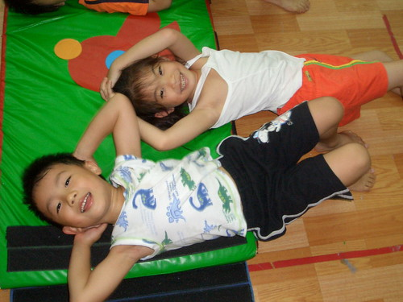  
  
全校只有阿徹班上的教室在一樓 其餘都在2樓  
雖然是因為園長這樣比較能兼顧班級跟辦公  
但講良心話 阿徹班上真的享受許多一樓的公共區域 遊戲區 閱讀室以及外面庭院  
早一點吃完飯的小孩可以去閱讀室看書 (不知道是不是這樣 阿徹吃飯都第一名)  
天氣好的時候 外籍老師常帶著在外頭曬太陽 玩遊戲  
莫非這也是一分錢一分貨嗎  
  
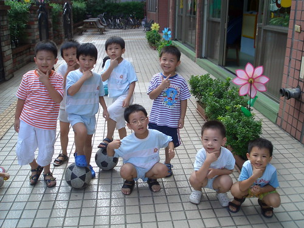  
  
momo電視台的\*\*姐姐跟\*\*哥哥到學校錄影  
  
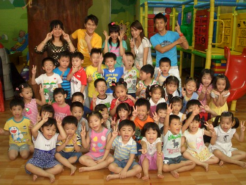  
  
這好像是動物園旁的劍湖山王國  
  
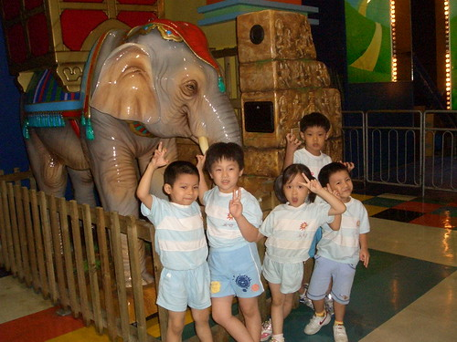  
  
這個月初總算第一次去動物園戶外教學  
(阿徹的粉紅襪很能跟女生的粉紅鞋相呼應吧)  
  
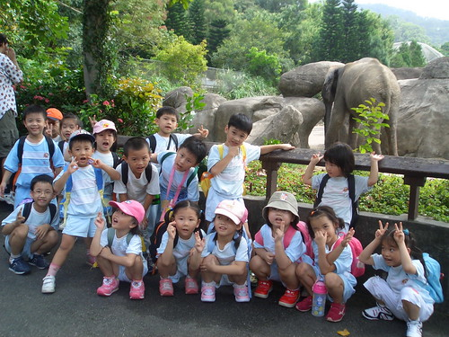  
  
在動物園聽說毛毛細雨  穿著雨衣小孩子好像更是興奮 (阿徹要我把雨衣洗好收起來)  
  
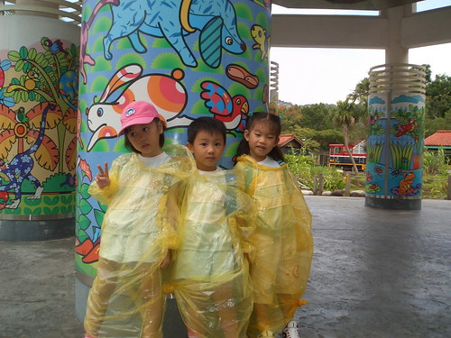  
  
YA~~  
娘真的好想再讀一次幼稚園喔  
  

