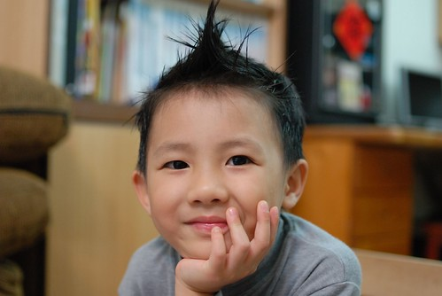
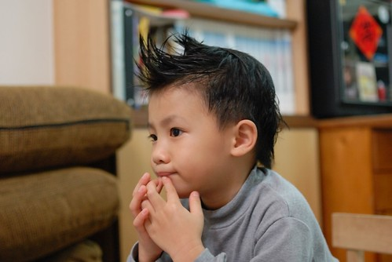
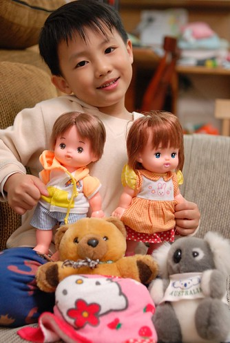
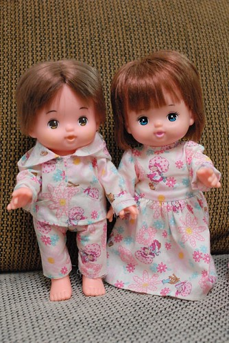
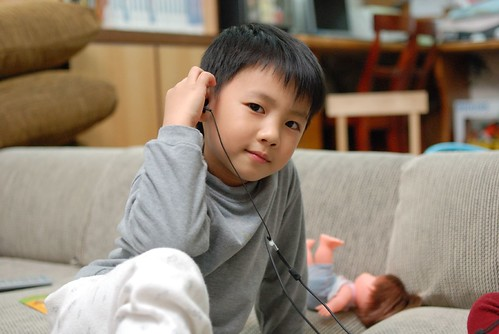
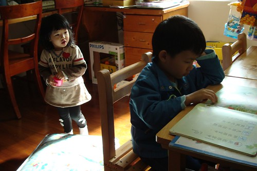

  
  
獨角仙終究在阿徹的五歲生日前就徹底的消失不見了  
但阿徹依舊天馬行空依舊莽莽撞撞 依舊屁股長疹坐立難安…  
三歲的時候阿徹說他以後要當小魔女  
四歲的時候有了看牙經驗阿徹說他以後要當牙醫師  
五歲的他又更貪心了他說他要先當看眼睛的醫生然後再當牙醫  
今天難得看到MOMO台後 竟然還說他以後想要當”MOMO姐姐”  
我說”那也應該是” MOMO哥哥才對吧”  阿徹一貫的傻笑回應… 

  
  
曾經阿徹說他要生一百個小孩  
我說一百個應該沒有女生願意幫你生這麼多小孩的 會生到老摳摳的  
阿徹說那生十個好了而且都要是女生喔因為男生太調皮了  
後來有一陣子阿徹似乎體認到養小孩似乎真的很累  
他說”我還是生三個就好了”…  
不過最近想一想他還是覺得要生十個比較好   
  
(阿徹好像很喜歡多子多孫的熱鬧樣)  
  
  
只是前一陣子為情所苦的阿徹很少再提結婚生小孩的事了  
他說”沒有人要跟我結婚…”  
看著難以釋懷情傷的他我們說”如果你都很溫柔對人很好 總有一天會遇到你想要跟她結婚 她也想要跟你結婚的女生的”  
有一天他一臉疑惑的問我”我有對\*\*\*很好了阿 那她什麼時候才會要跟我結婚阿”   
阿~~該怎麼讓阿徹明白感情的”落花有意 流水無情”這回事ㄋ…   
  
(徹嬤幫娃娃們做的衣服更顯得娃娃間的兩小無猜... 也許阿徹是羨慕娃娃的...)  
  
  
話說前陣子阿徹感冒胃口不佳    
有天老師跟我說阿徹真的生病了 午餐時連他最愛吃的獅子頭都不想吃  
當下我提高聲量的問老師"真假 他喜歡吃獅子頭 怎麼我做的他都不喜歡吃"  
我還好好討教了一下學校的獅子頭的材料跟作法  到底有什麼特殊秘方   
離開校門後 我問阿徹"聽說你喜歡吃獅子頭阿"  
阿徹用出乎我意外的表情與答案回答了我....  
  
他一臉莫可奈何的說"沒有阿  要把不喜歡的東西先吃掉阿"  
我一時還意會不過來的 ㄚ了一聲  幸好下一秒後我懂了  
我說"那你是不喜歡獅子頭 所以要先把它吃掉阿"  
阿徹說"對阿  Freda還給我兩個..." (用著高八度與不可置信的語氣強調"兩個")  
我忍不住大笑說"Freda大概看你這麼快把獅子頭吃完 以為你很喜歡 所以才會又多給你阿"  
  
後來跟Freda說起這件事時  Freda笑著說"原來是我會錯意啦"  
Freda說 大部分小孩都很喜歡獅子頭 都會希望多吃一點  
所以Freda會要小朋友們先吃完後才可以再拿半顆  
她以為阿徹很喜歡  還特別關照的給他兩顆哩    
想不到原來都是誤會一場阿.....  
  
徹爸說阿徹的這套"把不喜歡吃的東西先吃掉 最好吃的留在最後"哲學跟他一樣  
只是小心阿...可能不喜歡的東西吃完就飽了 怎麼還有肚子與力氣吃最喜歡的ㄚ  
不過也也許要把最喜歡的留在最後  才有動力把所有東西吃完吧...  
  
  
  
跟徹爸兩人一致覺得阿徹最近又長大成熟了  
雖然依舊有許多無厘頭事件發生  但脾氣滅了許多 腦袋秀逗的機會也少多了  
雖然很安慰 但還是有種不可置信的感覺   
原來當爸媽要一直調適小孩在長大這件事...  
  
早上準備好要上學前  總是到遊戲區消磨等媽媽的時間   或是玩積木 畫圖 或是看書  
看到這模樣更深深覺得小阿徹已經長大嚕.... (相較之下 小愛果然還是個娃阿  )  
  

