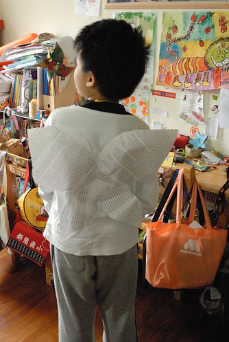
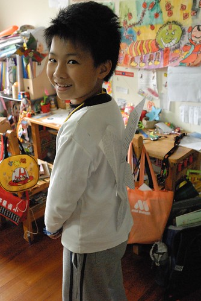
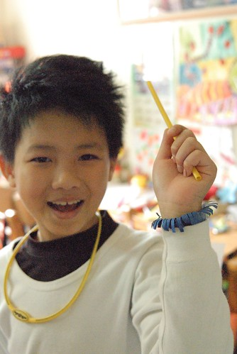
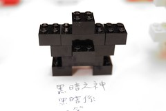
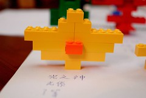
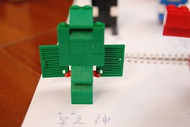
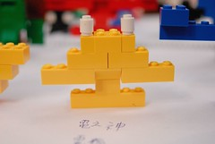
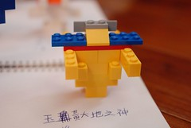
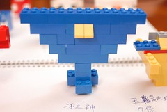
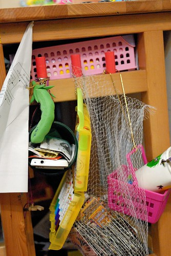

前天晚上我難得超級冷靜的聽著 看著徹愛兩人之間的爭吵 事件的起因為回家後阿徹邊跟小男生玩著遊戲邊等著愛愛寫完功課後一起加入遊戲 遊戲玩到一半 小男生不想玩了於是兩個男生改玩別的遊戲 結果趕忙寫完功課的愛愛準備要加入遊戲時 發現怎麼遊戲換了 不是一開始讓她趕著寫完功課的遊戲 於是愛愛不想加入哥哥的遊戲了且小男生還跳槽去愛愛的遊戲中 阿徹好生氣 好難過 怎麼妹妹跟一開始說的不一樣 沒跟他一起玩... 等到吃晚餐時 我總算可以坐下來好好的聽兩人的說法 阿徹越說越生氣也越難過 哭到眼淚鼻涕都拌到飯裏了 阿徹說"我可以等一下再吃嗎 現在這樣我沒辦法好好吃飯"  然後跑到他床上嚎啕大哭 坐在餐桌的愛愛也跟著放聲大哭起來   而我繼續吃我的飯 同時按下計時器3分鐘的計時 3分鐘後請兩人收好眼淚回到餐桌繼續晚餐  阿徹把剩下的飯吃光光然後還再跟我多要了半碗黃帝豆湯 當阿徹把要再盛湯的空碗遞給我時 我心裡還真是驚訝+讚佩 因為可以做到傷心歸傷心但還是好好吃飯 甚至還能享受喜歡的食物 這點真的很棒! 飯後我們又再好好的溝通整件事 雖然兄妹倆當晚還是沒法立即釋懷 但就如徹爸所說"有讓對方了解自己的心意最重要" 而且這就像時下的愛情 因為愛的深所以在乎阿~ 不過隔天回家的路上 看到兄妹倆開心的手牽著手 討論著兩人要玩什麼遊戲時 我還是忍不住三條線 -.-"'

阿徹的鬼點子有多多 多麼異想天開已經是普天下皆知的事情 只不過還是很難讓我們置信的是 為什麼三年級了 10歲了還可以這樣  可以說他單純  說他純真 但也可以說他幼稚 甚至說他呆 所以常會忍不住的想摸摸他的頭 拍拍她的屁股 但也常會火冒三丈的請他別這麼活在自己的世界中 阿徹兩三歲的時後 心裡住著一個獨角仙(美賢阿姨一定記得) 獨角仙常會跟他說話 陪他玩 陪他上學  親密到讓我們有點小擔心阿徹會不會有多重人格阿 幸好4歲多 妹妹很會跟他一起玩後 獨角仙漸漸從阿徹的世界消失了 直到長大到開始看火影忍者 阿徹有了他的忍者夢想也在心中建立起他的"神之國" 又再開始玩線上遊戲賽爾號後 阿徹在他的畫本 課本 遊戲中也開始建立起他的小星球 他常拿著做的小樂高 衝進廚房開心的告訴我 這是什麼系...  我總說"媽媽在廚房忙翻了" 回家的路上 當我還在疲勞的恍神中 而他唧唧喳喳的告訴我什麼星好厲害.. 我也總說"我現在不想聽這些揶" 但每當我可以好好坐下來"看"阿徹說或是待他睡著後方能細細觀看他的作品時 我常忍不住噗嗤笑出聲 "原來阿徹的小腦瓜裝滿了這些東西" 也難怪小小的腦袋常忘記應該記得的東西 應該做的事.... 雖然有時候很無奈 但面對著徹爸的揶揄"你兒子喔?" 我還是會大聲的說"是的 他是我兒子!" 聽著阿徹拿著每一個小樂高 說著他是什麼系 有什麼樣的功能 真的不得不佩服他這方面的"天份" 但也不得不小小感嘆 如果唸書有這麼認真有這麼厲害就好... 只能安慰自己或許自己有機會是下一個吳季綱或是周杰倫的媽  創作有很多不一樣的形式 這些是阿徹式      

                  

只是阿徹阿~你的錯字真的太多啦 隨處可見你的錯別字 Orz 而另一方面 阿徹的藝術家似 說是隨性或可以說是邋遢的個性也表現在他的週遭環境中 抽屜塞滿他所謂的美勞用品 甚至從學校或家裡資源回收箱撿回的寶貝 不夠放的 再想辦法掛在書桌旁(這點就絕對是跟徹爸學的) 再不 連牆上的名牌都可以變成一個置物袋  抑或者想辦法 偷偷放在家裡所有可以放的地方.... 因此阿徹的桌上永遠整齊不超過兩天 而我們沒有一天不念著'阿徹~收好你的東西 你的桌子~"  我不知道阿徹以後會不會是個創作者藝術家 但我現在百分百相信這些人的媽肯定很了不得 因為絕對有著異常的耐性與包容力! 真的 小孩養育的過程 考驗的不是小孩而是爸媽阿~
