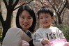
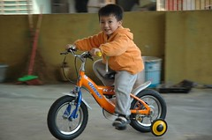
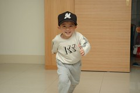

看著天上的上弦月 阿徹常一臉認真的跟我說"香蕉是月亮變的喔"  
偶而看到香蕉他也會開心熱情認真的跟旁人說"香蕉是月亮變的喔"  
而旁人瞬間常會露出一臉"啥"的表情

某天看到天上3/4圓的月亮  
我說"今天的月亮不是香蕉耶"  
徹說"對阿"  
我說"今天的月亮像啥ㄚ"  
徹說"像會飛的火箭"  
咦~果然有像發射的火箭耶

老師問小朋友"如果會飛 小朋友想要做什麼阿"  
徹說"要飛去跟月亮玩"  
月亮果然是阿徹的鄰家婆婆阿~

某天早上阿徹打開廁所門找正在嗯大便的爸  
看到爸爸蹲在馬桶上醞釀  
阿徹說"不是這樣啦"  
爸爸說"我不會坐著恩大便啦"  
阿徹說"我教你..."  
哈哈哈~

某次又跟阿徹在聊他肚裡獨角仙的五四三時  
阿徹突然看著妹妹說"妹妹肚子裡有青蛙"  
我說"ㄚ~青蛙?"  
徹說"青蛙是獨角仙的好朋友喔"

徹爸常說 我都亂跟阿徹瞎扯蛋 盡教他些有的沒的  
不怕阿徹在外頭瞎扯 讓人家覺得他腦袋怪怪的  
呵~有啥怪 小孩的想像力本來就是天馬行空的  
哪天他不這樣跟我瞎扯了  
我可能才會傷心我的小阿徹已經離我而去了ㄋ  
況且阿徹的童言童語可是我跟徹爸每天快樂的泉源ㄋ  
常常睡前兩人躺在床上一起回味阿徹的言語而哈哈大笑  
然後帶著滿滿的幸福感見周公去~

