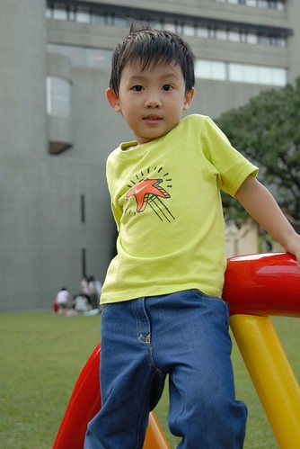

  
  

前一陣子阿徹突然很喜歡看一個卡通叫做"阿虎開竅了"  
當別的小孩會畫畫 會寫字 會讀書 不會吃東西吃的邋哩邋遢的時候  
阿虎卻什麼都做不好  
阿虎爸爸常問阿虎媽媽 "阿虎是怎麼回事呀"  
阿虎媽媽說"沒什麼啦 阿虎只是比別人慢一點開竅"  
阿虎爸爸想"那就好 慢一點總比永遠不開竅好"  
可是爸爸還是不放心的時常盯著阿虎 等他開竅…  
過了好久後的有一天 阿虎突然開竅了 他會寫字 會畫畫 會讀書了

我們笑阿徹"你這麼喜歡看阿虎 是不是覺得自己像阿虎阿…" 阿徹笑了笑  
有時候看到阿徹依舊6 9 不分 媽媽忍不住敲敲他的頭說"你是我們家的阿虎阿"  
當聽到或是看到老師們寫著阿徹學習英文有點不積極 不如預期時  
我跟徹爸跟阿徹說"爸爸媽媽沒要求你什麼事都要做很好 只要求你做什麼事都要認真 "  
但心裏天真的想" 也許哪一天我們家的阿徹也可以像阿虎那樣開竅的"…  
阿徹點了點頭 答應了我們做事情要認真  在學校學習要認真  
真的嗎? 不知道耶…等他開竅的那一天也許我們就明白了…
