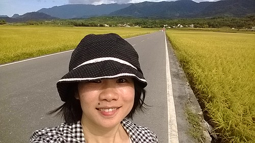
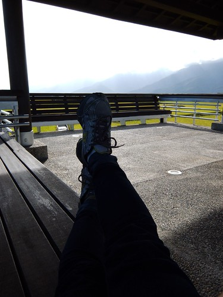

自從六月去台東騎車後 好久沒有去郊外了 而且八月開始 每次想出門的週末天氣必不好 心都快發霉了... 雙十節那天難得的藍天白雲好日子 可是竟然沒人想陪我出門踏青去 沮喪難過的我 第一次有了自己出門旅行的想法... 睡不著覺的早起清晨 輕鬆訂到應該不好訂的火車票 我想老天爺是在告訴我"去吧~"吧! 於是10年來從沒跟家裡請過假的媽媽 真的自己一個人去旅行! 在最適合旅行的秋天  最喜歡的稻穗時分 去最喜歡的南花蓮~

訂到車票後 我才開始決定民宿跟訂房 然後才陸續發現11月第一個週末的花東好熱鬧 池上有秋收雲門表演 花蓮有太魯閣馬拉松 我更加覺得自己能訂到火車票真的是好運氣 所以即使老公小孩希望我不要去的氛圍 讓我好幾次動搖想取消算了 我最終還是沒辜負老天的好意 勇敢自己一個人旅行去

出發前幾天告訴徹愛媽媽這週末會不在家的時後 愛愛從背後抱著我好久不說話 然後開始啜泣... 我跟徹愛說"你們已經長大了 該明白也接受 大人也是有情緒 也是需要休息的" 徹愛懂得 但還是會忍不住常小聲念著"好希望媽媽不要去.."  而家裡也總瀰漫著一股淡淡的哀愁

徹爸很棒! 雖然覺得老婆自己一個人去旅行對於身為老公來說是很大的打擊 還是用祝福的心幫我打點好一台讓我可以盡情使用的相機 而且如我始終相信的 可以打理好我不在家的家裡 徹哥也很棒! 雖然很不捨 但任何一次都沒說出口"媽媽不要去" 很堅強的面對媽媽的決定與妹妹每次的哭泣 還一直叮嚀媽媽自己一個人要小心 愛妹妹當然也有棒! 雖然電話中的她好沉默  還在第二晚在電話那頭大哭起來 哭了很久 但聽說每一餐她都吃好多 吃好快 而且即使一直不想讓媽媽自己出門 還是在行前畫了畫送我  畫之前 愛愛請我在整張白的畫紙某個地方橫向寫下我的名字 收到畫後 看到她的鋪梗  我大笑不已 但紅了的眼睛 我不知道是因為太高興還是有點難過...

帶著一家子的祝福與叮嚀 陳小姐在11月的第一天自己出門旅行去~  訂的火車是板橋跟玉里間的來回票 然後靠著火車 摩拓車 腳踏車 還有一雙腳 從池上到富里 然後玉里 看到了我心目中一直很嚮往的秋天稻穗 在池上萬安  在富里羅山村  在玉里  還有南安  而且因應不同天氣  看見不同版本的稻穗景象 有大晴天下的金黃耀眼 雨天中的詩情畫意 以及清早時分的清新怡人 幸運事再添一樁!  一個人雖然連個說話的對象都沒有 但腦子剛好完全的放鬆 休息  一個人也想走就走 想停就停  百分百順著當下自己的心意走  搞自閉 搞文青 搞得理所當然還怡然自得  回家後 徹爸幫我整理照片時說 "覺得照片中的你好開心"  我看著徹爸 很誠懇但有點不好意思的說"對不起! 我真的玩得很開心" 看見好美麗的風景 遇到好感動的人們與分享 真的是趟很棒的旅行阿!  雖然短短三天的旅行 而且還在台灣 其實根本沒什麼 但對於我來講卻真的是很大的突破! 希望這次的勇氣 沉靜 感動... 多了好幾格的電力可以讓自己開心努力好一陣子!  我說 我以後每年都要這樣自己一個人去旅行 小人哀嚎著"不要啦~" 但是接著跟我說"可是只有結婚紀念日前可以去一次" 嗯~ 很棒的結婚紀念日禮物~ 只是這次回家後看到冷水壺的水只少掉一杯  刻意放在流理臺上的兩顆奇異果依然健在 更別說晾著的衣服還高掛著... 家始終如一的等著媽媽回家阿~ 哈哈~
