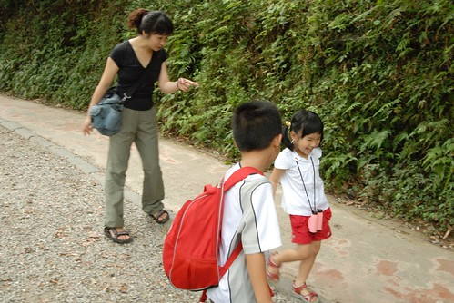

很久沒有去山上走走了... 尤其當工作/生活的壓力很大時會讓人更想去山上走走的 前兩週的週五晚上 徹爸突然的一句"明天來去山上走走吧" 讓我們家很久沒拿出的台北登山健行書總算又被翻出來了 目標鎖定涼爽有樹陰而且又不是太難的步道   於是標榜五星級的陽明山二子坪步道勝出.. 週六一早全家7點起床著裝早早出門往山裡去~

二子坪步道位於陽明山百拉卡公路口 光從板橋到步道口就花了1個小時多些的時間 不過上陽明山的沿路上看著那些賣力騎單車上山的旅客倒是件很有趣的事 今早來此步行的遊客不少 費了點時間才把車子停在黃線上 (抱著花錢買經驗 賭他一把的決心) 然後輕裝簡便外加愉悅愜意的心情 開始我們今日的步道行  

二子坪步道全長1.7公里  雖然有點短很適合今日的愜意以及那個不愛爬山的阿徹 而若走的不過癮則還可以繼續往向天湖或是大屯公園的步道 ( 這個就來日再戰了) 

二子坪步道沿途樹木扶蔭 

小石子道路平緩易行 

且全程設有無障礙步道  是條非常適合推娃娃車或是行動不變的人的易親近步道 也因此旅行家劉克襄先生稱此步道為五星級步道 

走著走著...無障礙坡道的小磚邊竟也被阿徹跟小愛當起平衡木練習 

光這樣兄妹倆就又玩得好開心 

偶而來山裡這樣走走感覺真的粉舒服 尤其是炎熱的夏季裡是小避暑的好地方 只是周末要回阿公阿嬤家 要打掃家裡 要騎車 要登山....這這時間怎麼夠 怎麼分配阿.... 不免讚嘆人生還真是忙碌 

四個人沿途說說笑笑 沒一會就快抵達二子坪遊憩區 

轉個彎 步出步道便看見這樣開闊 別有一番洞天的景致 很令人開心 

遊憩區裡有幾個或大或小的生態池 自然生態很豐富 

山景也很棒 

像這樣一家子坐在岸邊  一人一顆蘋果啃著 一種讓人羨慕的平凡幸福 

而沒有蘋果吃的我們 靠著一包Pocky草莓棒  努力假想自己也是來野餐... 

今日阿徹的包包裝了自己跟爸爸的手套 準備有機會來練習傳接球 

小子還很遜 但相信多練習便會多進步的 繼續加油... 

生態池裡開了幾株蓮花 趁著父子倆練球時 我拿了小倆想去練習拍荷花 才發現出一張嘴比動手簡單多了  這種需要天份跟技術的事還是交給徹爸好了 

花了點時間上山 走了一小段路 吸收了一些山"氣"    希望這就是接下來工作的動力.. 

接近中午時分再踏著愉快的心情邊玩邊說的回頭走 

衝阿~ 好吃的關渡美食等著我們 

帶了阿徹小愛去上回我跟徹爸騎車到關渡時吃過的好吃簡餐店 飯後又一起嗑了一碗紅豆牛奶冰 可愛的妹妹老闆一開始就給了我們四支湯匙很是貼心 讓人覺得這冰更是美味了 

而第一次大口大口吃挫冰的阿徹更是吃的大暢懷 大開心  滿足的模樣連妹妹老闆看的也笑哈哈 

下午1點半多而已卻感覺一家子已經起床很久 活動很久 原來周末早起的感覺真的很不錯  下回放假時真的別再賴床了...................
