阿徹很喜歡喝蜂蜜 蜂蜜在我們家算是獎勵性的"飲料" 不過一直覺得蜂蜜是很甜的東西  所以其實並不太喜歡給小孩喝太多 而家裡的蜂蜜也幾乎都是從兩邊的阿公阿嬤家那拿的 老人家總會說"蜂蜜很好 多泡點給小孩喝" 可是老實講看著那一大塑膠桶裝的龍眼蜂蜜(就像加油站賣的那種) 我一直很懷疑這是真的蜂蜜嗎 曾經有個親阿姨送了瓶她們去野外找蜂窩而取得的純正蜂蜜給我 喝起來不甜不膩的讓我覺得 真的蜂蜜真的不是糖水 就像老人家說的真蜂蜜是不會生螞蟻的 ...(考個冷笑話 糖果是男生還是女生?) 我一直很想買好喝的"真"蜂蜜但卻一直不知道該上哪去買 有次在板橋農會超市裡看到十幾二十種的蜂蜜很興奮  但我最後卻還是因為不知道該選擇哪一瓶而作罷.. 八月初看天下雜誌時看到蜜蜂故事館的介紹感覺很"真"的樣子 因此在父親節回嘉義的時候我們順道去了雲林古坑旗艦店參觀買蜜

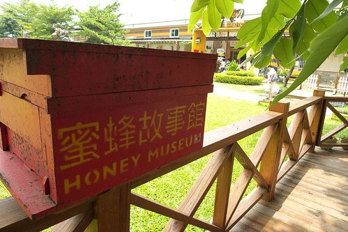

蜜蜂故事館的旗艦店就位於雲林古坑綠色隧道入口處旁 走中山高或二高切X號快速道路過去即可到達 那天我們在大中午12點時抵達  雖然太陽很大但下車後即被眼前的景緻給閃到張大眼 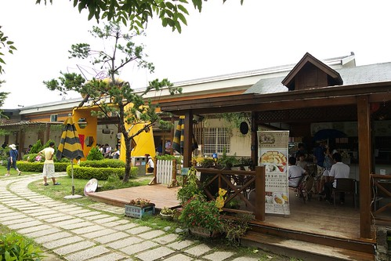' ' 從入口處經過戶外咖啡館 我們往本館方向前進 是啥咪東西讓我們母子三人看的一臉驚愕 害怕的模樣ㄋ??? (左邊那位歐巴桑真想打馬賽克) 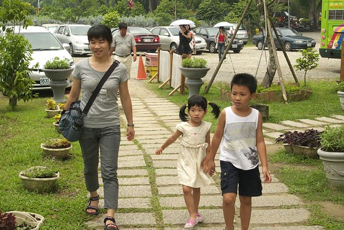 

原來是故事館大門上方的那隻大蜂蜜  視覺效果十足阿! 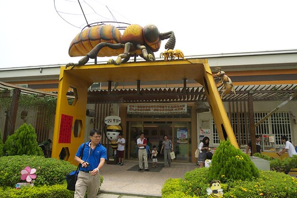

故事館的前方便是這樣一片美麗的大草坪 如果不是夏天裡的大中午  這樣的一片草坪多麼適合闔家大小在上面嬉戲跑跳阿 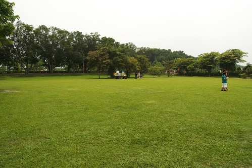

正門口右邊通往廁所的路上也是這樣涼快雅緻的戶外座椅區 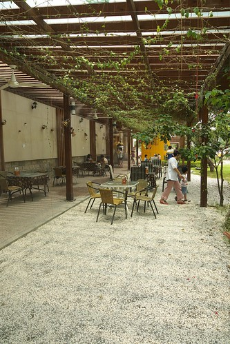

一旁也還有養蜂箱的展示(裡頭應該沒有蜜蜂) 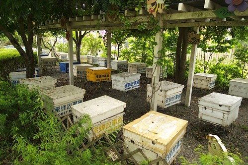

整體戶外庭園的感覺非常好 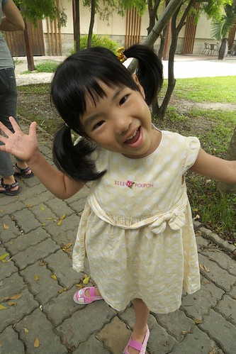

進入故事館內參觀前跟可愛的蜜蜂人來個到此一遊照 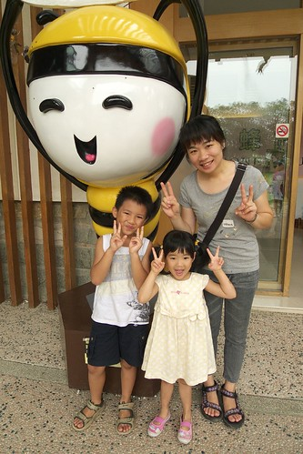

愛愛很喜歡這個蜜蜂娃娃 跟她一樣頭大大身體瘦瘦小小的 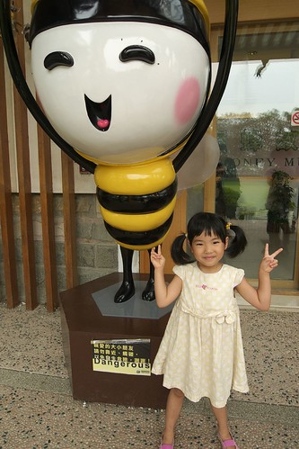

故事館內約有一半的空間是蜂蜜相關展覽陳列  而另半的空間在於商品的推廣販售 雖然這樣的故事館本來就是以販售營利為主要目的 但精心打造的環境/氛圍以及企業回饋鄉里的那份心意很值得讓人來這麼一回 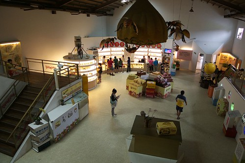

展覽區展示的物品數量雖不多 但足夠讓我們這些城市人多了解一些有關蜂蜜採收的資訊 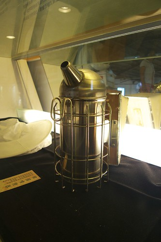

而當中陳列的蜂蜜蛋糕更是幾可亂真的讓人好想品嘗一塊阿 

下圖這是真的蜜蜂  有個展示櫃裡展示著滿滿一儲蜂箱的樣子 我們說這輩子從來沒見過這麼一大群蜂的樣子 雖然展示櫃夠緊密 但還是忍不住想像且擔心起 群蜂飛來的樣子 恐怖阿~ 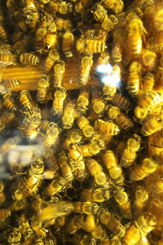

我們並未仔細閱讀展覽的文字說明  因為一心想趕緊買完蜂蜜後回嘉義吃中餐.. 天下雜誌上有關蜜蜂故事館的介紹中提及這裡的員工流動率很低  每個員工都很以這裡的工作為榮且熱在其中 當我們在櫃檯區試喝蜂蜜時 果然就有感受到工作人員的熱情與熱誠阿 一位小姐看到我們趨近時 便熱絡的喚著"來喝喝看蜂蜜 不一定要買" 然後小姐給了我們四個人四個小杯子  每一種蜂蜜的試喝就這樣四個人皆倒一輪 且仔仔細細的解說不同花種 不同區域(台灣vs.清邁)蜂蜜的不同 且引領我們去體會箇中的味覺差異 我們總共試喝了有7-8種的蜂蜜吧 也就是說小姐總共替我們這家子倒了28次的茶 且過程中完全沒再招攬招呼其他的客人 這樣熱切誠意的招呼當然讓本來就打算買蜂蜜的我們忍不住多帶了好幾瓶 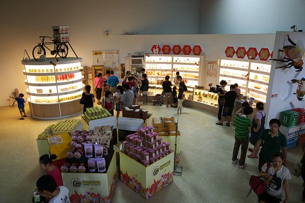

因為購買的金額達到一定數量 所以我們拿到了張會員卡 以後憑會員卡來古坑旗艦店消費滿500園都可以免費兌換一個蜂蜜冰淇淋 領了我們的蜂蜜冰淇淋 我們選了個涼爽的戶外庭園座位好好品嘗

徹爸這樣形容蜂蜜冰淇淋 剛入口時沒有什麼味道 可是準備吞下去的那剎好濃郁的蜂蜜蛋糕味道阿 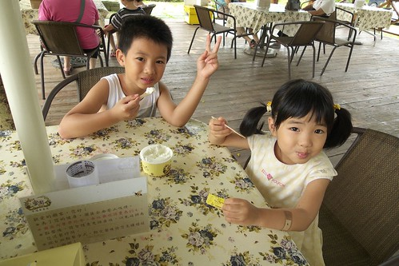

沒有錯 蜂蜜蛋糕的味道... 這真的不是用蜂蜜香精做的冰 是用純蜂蜜做的淡淡清爽真味道 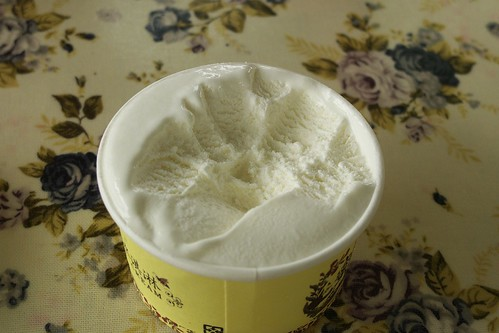

這些是我們今日的收穫  野花蜂蜜 龍眼蜂蜜 蜂蜜醋還有蜂蜜蛋糕 商品的LOGO 包裝 在在顯示其"品牌"的打造與堅持 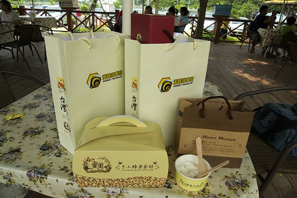

接著我們到旁邊的有名綠色隧道小散步一下 這是我們第一次來雲林 我很驚訝於這樣的好"綠"景 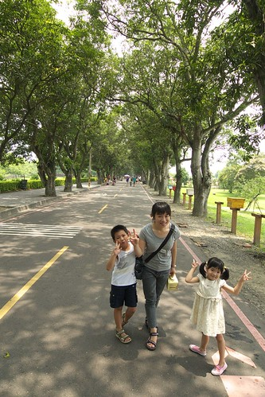

隧道的一邊規劃有各種當地特產或文藝物品的攤位 不同於一般市集或老街各形各樣的雜亂  感覺相當乾淨整齊有序 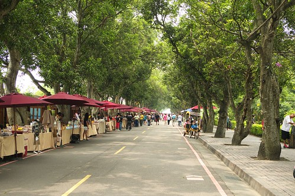

市集中甚至有像這樣小巧佈置的小店  (門前樹上還掛了一掛蕉哩) 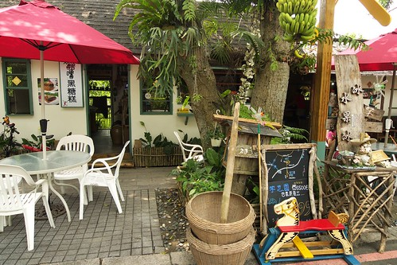

而中間段還有舞台的設置  有當地創造者的現場演唱 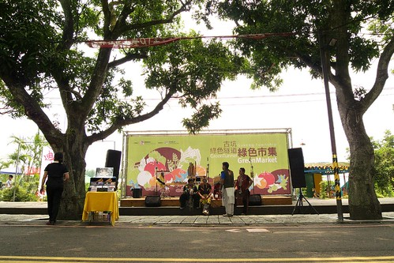

舞台前方的馬路另一側  則擺放了好幾排或大或小 或高或矮的小木椅供遊客休憩 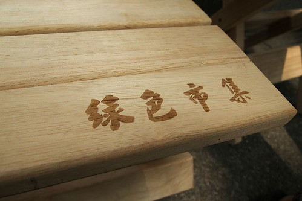'

真是整個感覺很不錯的地方  下回天氣涼爽的時候找個機會再來這裡好好散個步~ 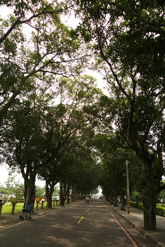

現在大中午日頭赤焰焰 阿徹的汗如'雨後春筍'般的湧現  還是快回嘉義為上策...................... 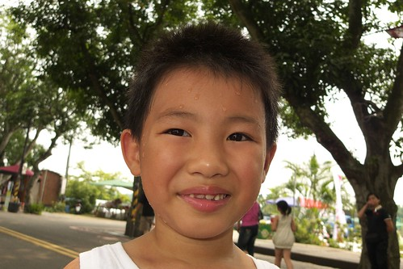
