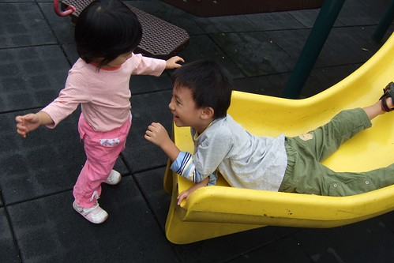

雙十節這天那都不太想去  
只想輕輕鬆鬆的 悠閒的度過這難得的非週末假期  
於是帶了小孩去公園走走 去吃頓好久沒吃到的好吃涮涮鍋 然後回家睡午覺 然後回陳嬤家吃晚飯  
(其實還是很徹家風格的平凡啦 卻被我講的很不得了的樣子)  
  
今天總算有點秋意了  
雖然太陽沒有露臉 但涼涼的風 舒適的27度   一整個的適合閒晃蕩  
雖是閒晃 但還是有目標的去了阿徹說了好久的音樂公園(去年冬天戶外教學去过後 阿徹就唸唸不忘)  
其實這音樂公園離我們家並不遠 開車或騎車都只要10分左右就可以到  
但來板橋住了2年多 我們竟然今天才第一次去   
真的就像是身邊的美景卻往往是最遙遠的 (又像是人家問徹爸嘉義哪好玩 徹爸都說沒啥好玩)  
  
去公園當然主要就是要讓小孩子玩溜滑梯   (有滑梯的地方就可以稱作公園了)  
  

現在認何公園裡的大大小小滑梯 都難不著阿徹了  
可以自己一個人毫無障礙的穿梭各滑梯間  
甚至常像是在跟媽媽玩躲貓貓似的來無影去無蹤  
讓沒看到小孩身影的媽媽擔心小孩會不會一個不小心就被擄走  
  
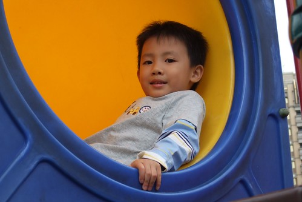  
  
小愛則是選定一個滑梯後就固定 固執的只玩這一個  
  
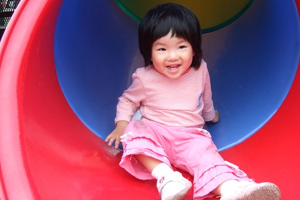  
  
阿徹最近好愛倒退著溜滑梯   
忍不住叨唸他這樣有點危險哩 一不小心就滾下來  
後來才知道 竟然是爸爸教他的 ㄘㄟˊ 然後阿徹就愛上了這樣倒著的感覺   
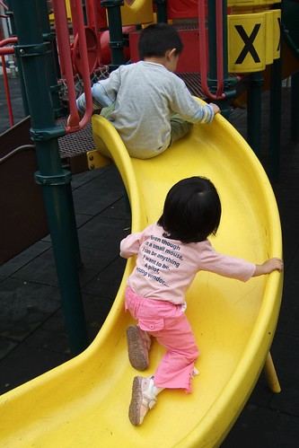  
  
阿徹之前常說音樂公園有鋼琴 有喇叭 有好多樂器(講的讓爸媽很好奇 很心動)  
鋼琴? 鋼琴在哪? 鋼琴就在後面的台階上  
  
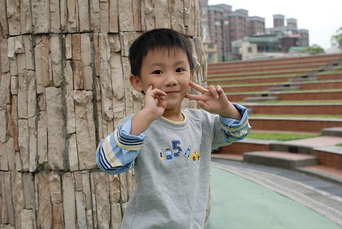  
  
這就是那大大的鋼琴     
大概只有無敵鐵金剛才有辦法彈的超大size  
  
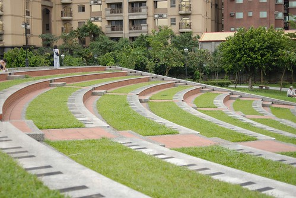  
  
小愛 你恐怕連一個鍵都彈不動  
  
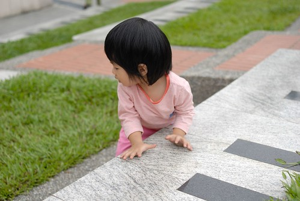  
  
這一階一階的琴鍵 真的是很特別 有心意的創意  
特別的還有前方表演台旁的磁磚壁畫  
  
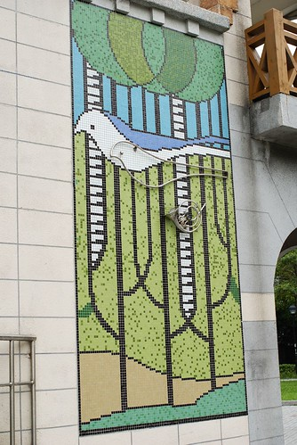  
  
涼爽的秋 閒晃的坐在這  望著前方的壁畫 四處跑跳的小孩  
吼~kimo好的多說什麼都是畫蛇添足   
  
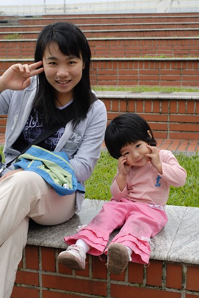  
  
以後週末真的可以多來這走走 很不一樣感覺的公園   
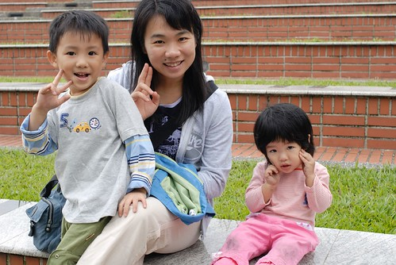  
  
這公園裡還有都市裡難得一見的大草坪  
草坪上還有大喇叭 跟\*\*鼓 (美賢阿姨這是什麼鼓)  
小孩要先爬上喇叭  坐穩後才能敲的到鼓  
  
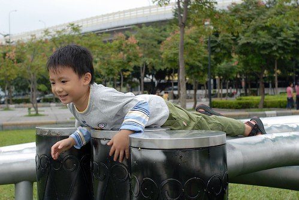  
  
show一段吧 (徹爸這張的感覺抓的真是好 認真的神韻 動感的雙手)  
  
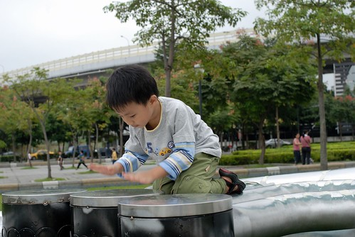  
  
小愛也要上去參一腳  
只是小愛的短腿 很難安全的坐在這寬銅管上  
  
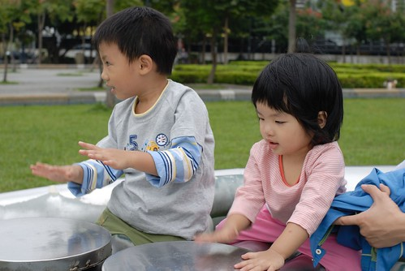  
  
走在公園裡 看著四周新蓋好的房子  
心動~心動~心動阿~~~  
幻想著如果自己也可以住在這 開窗就面對著這樣的公園  
徹爸說這離捷運站這麼遠  房價應該比我們家捷運口便宜吧  
我說有公園哩 而且面對河岸 視野這麼好 應該起碼一樣吧  
回家後 我很不知死活的上網查房屋仲介這的房價  
哇勒~~還是當做白日夢做做就好  
安慰自己"其實我們家旁邊的兩座公園 有籃球場 有大人工草坪 很不錯啦 "  
所以還是寬心的繼續住在我們30年的小公寓裡吧   
不過我還是很難得的做起發財夢  考慮要來買樂透   
也許哪天真的讓我中了 那就可以來這買view了 (哈哈 真是瘋了)  
  
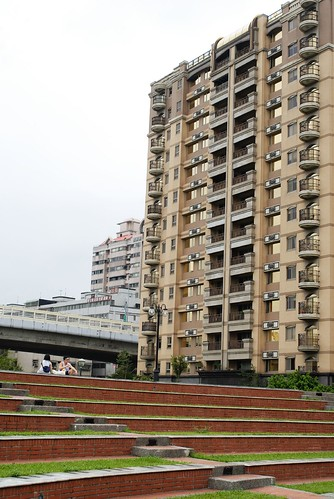
