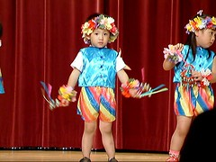
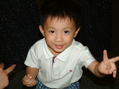
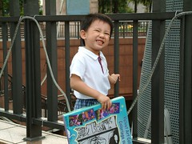

期待已久的音樂發表會總算到了  
雖然前幾天已經先偷偷跟老師打探阿徹她們表演的曲目  
也知道表演的曲子跟阿徹在家唱的完全不同  
但還是很期待阿徹的秘密ㄋ  
有種我家兒子要給我們surprise的期待興奮感

只是老師上週四說 那天她們試穿表演的服裝時  
阿徹不管怎麼樣就是不肯穿 就是很ㄍㄧㄥ啦  
害我開始擔心起他會在台上ㄍㄧㄥ到爆  
除了再三跟阿徹確認"要穿自己的衣服還是跟小朋友穿一樣的衣服表演"  
(他都一附理所當然的樣子回答穿一樣的)  
也請老師把衣服讓阿徹帶回家  
要來想各辦法拐他穿那套"夏威夷裝"  
阿知帶回家後他卻又很得意那是他表演時要穿的衣服  
真是讓我三條線~

週日忙完外公的競選總部成立大會後  
一家人就又急忙忙的回家打理去阿徹的音樂發表會  
一到會場時剛好各班老師在前面站一排 等小朋友去認領排隊  
結果阿徹是她們班上第一也唯一去認領的人  
等了一會 總算有4各小朋友來報到了  
跟徹爸還開玩笑說 會不會等會剛好左右邊各2人阿  
幼幼班的節目排在第二各  
一出場時 全場一片笑聲  
因為真的個都好小ㄚ  
還都一臉呆頭呆臉的模樣  
主持的體能老師也覺好笑就忍不住開始"體雄"他兒子的故事  
害我跟徹爸忍不住嘀咕"還不快開始 等會全哭出來了"  
好不容易在台上等了2分多鐘  
寶寶熊的小朋友們正式開始表演嚕  
雖然小朋友們依然一臉呆臉的搖著響鈴 敲著響板  
但台下已經隨著她們的音樂快笑翻了  
有人哭 有人東張西望 有人努力的數著拍子跟著老師的動作  
雖然那時我也忍不住笑出聲  
但心裡真的忍不住福上一股驕傲感  
"好樣的 張有徹 你真的沒哭 你做到了"

  

表演前的等待

[http://myvlog.im.tv/?id=421195&mid=322793](http://myvlog.im.tv/?id=421195&mid=322793)

正式表演

[http://myvlog.im.tv/?id=421186&mid=322793](http://myvlog.im.tv/?id=421186&mid=322793)

正式表演 part2

[http://myvlog.im.tv/?id=421437&mid=322793](http://myvlog.im.tv/?id=421437&mid=322793)

第一首表演歌曲是小蜜蜂  
阿徹東張西望的一會看看右邊哭泣的同學  
一會看看左邊賣力演出的同學  
自己很明顯的拍子慢三拍  
等到第二首1237567時  
節奏跟的很好喔 連我在台下都可以感受到這小子有用心在數拍子拍響鈴  
很讚喔 表演結束時都忍不住用我抱著妹妹的手奮力擊掌  
而阿徹也很開心的大搖大擺下台去

其實整體來說小朋友在台上的表現都很好  
反倒是父母都很緊張  
看到自己的小孩出場時 拿著DV就往舞台前衝  
尤其是最後全體幼兒大合唱時  
那場面還真的有點恐怖  
台上100名小朋友乖乖的排好對等表演  
而台前也有近百台的DV爭先恐後的卡位  
就如主持人所形容 那場面甄有點像'暴動'一點也不誇張  
我坐在座位上 只能看到台上一片五彩繽紛以及台前一片黑壓壓(一群拿著DV的大人)  
心裡直想 哇勒小朋友擠在一起就算了 大人也卡位卡的這麼凶  
徹爸怎麼可能殺出一條血路阿  
結果徹爸說 他找到小孩後就把相機拿高高的直錄  
中間還突然發現阿徹怎麼不見了還得努力搜尋一番  
呵呵~還真多虧了爸爸的努力 讓我得以看到阿徹最後賣力演出的樣子  
看完今天的表演 我們覺得阿徹真的很讚 又成長了  
而阿徹似乎也很得意他今天的表現喔  
在往停車場的路上得意的又笑又跳~  
小子!好樣的~

