放了長長二個月暑假的徹哥 在上週參加新國中二個半天的新生訓練後 總算有些感受到即將是國中生的殘酷 趁著新階段開始前 媽媽也該是對徹哥的國小高年級生活做個交代與了斷!

徹哥的五年級班級在新到校老師的帶領下氣勢如虹 在各個領域都有好表現 雖然徹哥能貢獻的實在微薄 但是喜歡班上的 尤其原住民血統的班導師  開放每天午餐時間為班上的點歌時間 (老師在班上備著卡拉OK) 除了成為同學心情抒發的管道 也培養同學們聽流行歌 唱流行歌 讓徹哥從本來只知道五月天 漸漸有了喜歡的女歌手也朗朗上口許多我們不熟悉的新生代歌曲 只是唯一的不好是老師讓班上如果表現好就可以每月開一次同樂會 一開始徹哥會熱切期待要帶什麼東西去跟同學一起玩 但漸漸他很不喜歡開同樂會  每次開同樂會前後幾天就是我跟他關係緊張的時候 因為老師開放同樂會可以帶手機來玩, 男生幾乎都是帶手機來對戰, 沒有手機的徹哥融不入又羨慕人家, 回家後就容易有死臉或是欠打言論出現 常怨嘆自己的爸媽為什麼不給他 常靠夭著他什麼時候能有手機... 於是徹哥的情緒同態度與表現就這麼的高高低低循環著 媽媽有時候真的不免感嘆 算是花了很多時間心力的陪伴到底還是比不過手機 而手機之於小孩 除了打發時間,玩遊戲 或許也某種程度在於尋求同儕的共鳴吧?! 也因此在徹哥畢業的那一天 我同意徹爸給了他自己的smart phone 也幫他申請了FB與line帳號 就是想讓他可以透過網路保持與同儕間的那一條線 二個月的使用下來  雖然有時不免碎念徹哥花太多時間在手機(不過有控制二天才能充一次電, 開學後改三天) 但卻也出乎我們預期的帶來些正向影響 例如穩定的情緒以及更心甘情願的付出(做家事 盡義務) 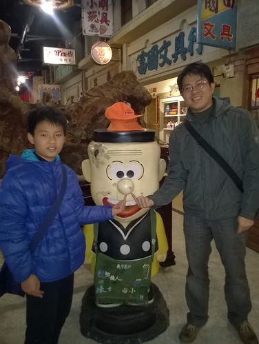 同時徹哥五年級很大的改變 甚至是天外飛來的一筆 憑著唯一強項的跳繩 讓體育老師誤以為他的運動神經很好而邀請加入學校足球隊 從沒想過自己可以加入校隊的徹哥就這樣加入從沒接觸過的足球運動 [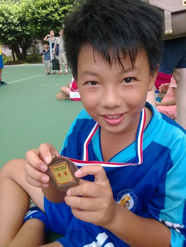](http://flickr.com/photos/33703965@N00/14725483159) 老實說徹哥的身體協調性是還不差 但運動神經就真的不是太強 尤其同年級隊友都已踢好幾年 而且徹哥微胖又跑不是很快 加上不積極的個性 連教練都曾這樣跟徹爸說"不只是老二 有徹是老三哲學" 徹哥一直是只有當球隊大幅領先或大勢已去時才會上場的板凳球員 在升上六年級時 我們曾經下通牒要徹哥拿出決心改變 要不索性退隊 徹哥被逼的果然顯見進步 堅持要繼續待球隊 即使他明白他一直很難上場 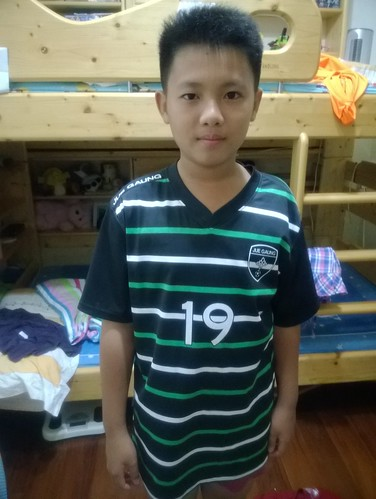 練球很辛苦 除了週間每天早自習要練球 週三與週六下午一整個下午的練球才真考驗耐性 尤其炎炎夏日中 但徹哥向來準時的出席退席 如他說的他在球隊很乖 因為教練說過 球技不是最重要 但品性不好就要退隊 徹哥深深明白 乖 是他可以待球隊的唯一方式 我曾經深深懷疑 徹哥是為了不想穿制服上學所以堅持努力留在球隊(穿隊服上學相較舒服多) 但徹哥後來似乎真踢出了點興趣 每次長時間的下午練球後 雖然一身髒與疲憊的回家 但興致卻是高昂的 總侃侃而談他的表現 他的進步 (五升六的暑假 週間每天上午四小時的練球 曬出了個V領) [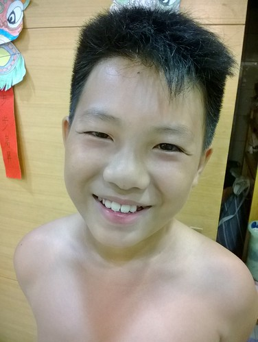](http://flickr.com/photos/33703965@N00/14655467014) 只是比賽本就殘酷 可以上場的即戰力畢竟還是球隊最看重的 所以每次比賽 徹哥總帶著不能上場的沮喪回家 尤其如果比賽剛好又撞到班級大活動時心情更是down 六年級後 徹哥在班上的人際關係漸漸不是太好 常會聽他憤憤不平的提起班上的不愉快 當然徹哥本來就容易暴衝的個性 加上有時憨直的近白目 但我們也不禁想是否因為參加球隊 少了跟班上同學相處時間以致越來越融不入班上 [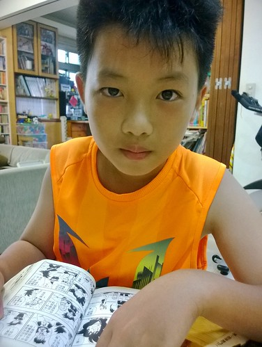](http://flickr.com/photos/33703965@N00/14471089978)高年級的男生 受同儕影響真的很大 看漫畫的胃口變廣且大  跟同學最能聊的就是一部部的漫畫 媽媽從小還算有用點心培養的閱讀  在這二年徹底被打擊 但逼也逼不來 也不想逼 到底還是只能順其自然 除非太誇張 媽媽偶而來個河東嘶吼 或是真的莫可奈何時  偶而恢復小時候媽媽睡前唸書習慣 加減陶冶一下兒子性情 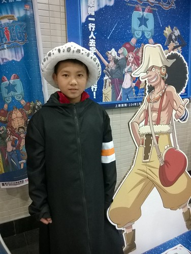 球隊 班上的問題 加上青春期前的年紀 以及天性 徹哥這二年越來越浮 循環的反應在他的球隊表現 功課學習 還有家庭生活中 我跟徹爸常在兄妹入睡後討論溝通(有時難免火爆)該如何幫 管 甚至逼徹哥 這二年是我當媽媽12年來最常感到沮喪的一段時間 (所以才一直難以記錄下徹哥的這四學期) 徹爸常提醒我莫忘初衷  老實講初衷難在於堅持 有時候我會找出二年前寫在BLOG那篇有關昆蟲老師的讀後感 [blog.yam.com/hmchen1975/article/67389071](http://blog.yam.com/hmchen1975/article/67389071) 找回我的初衷 給自己堅定的信心與走下去的勇氣 (話說徹愛二人一致認同這一年半載媽媽改變許多 人變好溫柔... 可證媽媽真的有自省有改變) 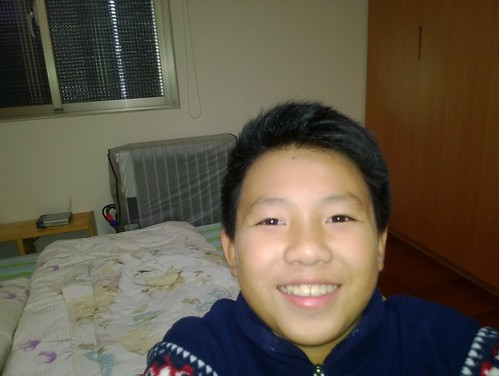 每次我同徹爸講完我們天兵徹的事後 常不經意就輕嘆一聲 而嘆完氣後 又總忍不住再接了句"其實阿徹是個好孩子" 徹爸總會笑我 "每個殺人犯的媽媽也都說自己的小孩是乖孩子" 唉 可我真覺得阿徹是個善良 單純 愛家的好孩子 只是純蠢 幼稚又"不務正業"了點....

每次看到老師學期末在成績單上的評語 我就更堅信阿徹是有潛力的 但也更明白他那外顯的缺點真的需要徹底的決心來改變的 (五年期上學期的成績單遺失了 只記得老師第一話是"有徹的眼神充滿了自信" 直到要畢業前 我才意識到曾幾何時徹哥漸漸失去自信 也難怪眼神越來越飄) 五年級下學期: 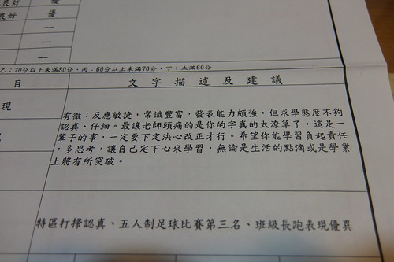 六年級上學期 [ 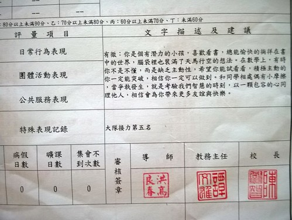](http://flickr.com/photos/33703965@N00/16443104670)六年級下學期 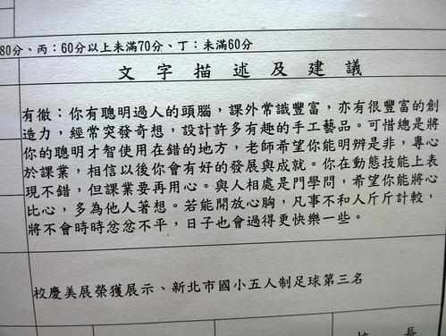 雖然徹爸總笑我(叮嚀我)"慈母多敗兒" 媽媽我就ㄧ直想堅信 阿徹只是開竅慢了點  有一天他會找到他願意且堅定努力的路的! 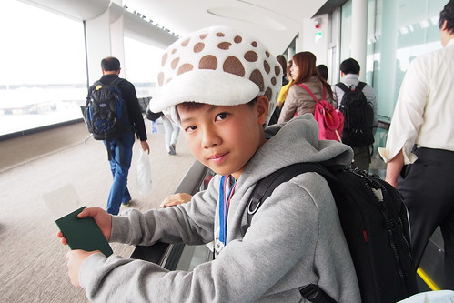 

最後就用照片順道紀錄下阿徹的不務正業事蹟: 徹自己形容的只有玩樂高跟看漫畫是唯二他能長時間專心的事 不若小男生喜歡的城市系列 徹哥喜歡的是小女生最愛的frind系列 蓋出一間間他所謂的民宿 飯店 百貨公司... 這是愛妹超級崇拜哥哥的地方 [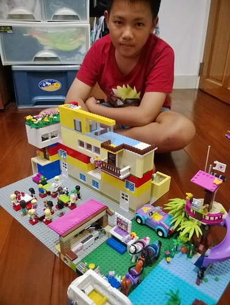](http://flickr.com/photos/33703965@N00/14725528198) 暖腳套也被徹哥變通成帽子 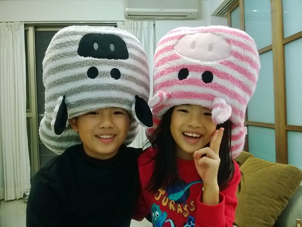 就是這些有的沒的詭點子 讓愛妹對他哥其實愛的不得了 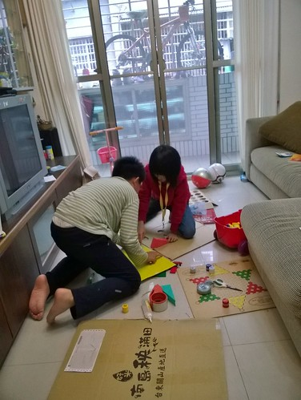 徹的創意常在不經意間 隨手之間 或許是無心 但他的手真的就是比家裡其他人多了些magic 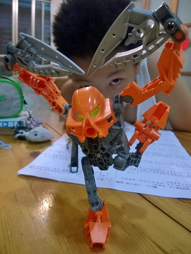 有時候看到徹哥專注又堅持在一件課業以外的事上  我會很感動 欣慰他也是能貫徹始終的 (不辱他的名阿) [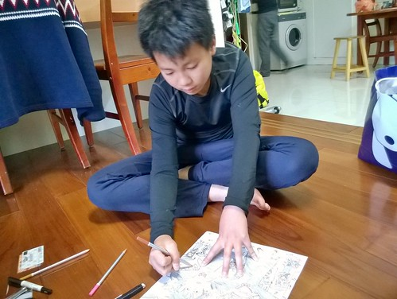](http://flickr.com/photos/33703965@N00/16629015571) 花了好多小時畫的畢業紀念冊封面投稿 [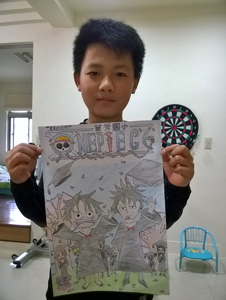](http://flickr.com/photos/33703965@N00/16604147986) 花了好幾個夜晚做的戲劇道具三把劍 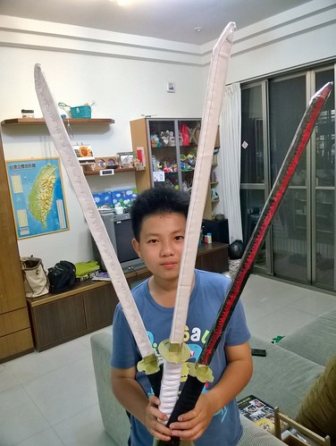 真的! 我樂觀期待徹哥脫胎換骨的那一天 或許需要的時間很長 或許前進十步退九步... 但 是他自己一步一步的累積 終是他一輩子的擁有.... 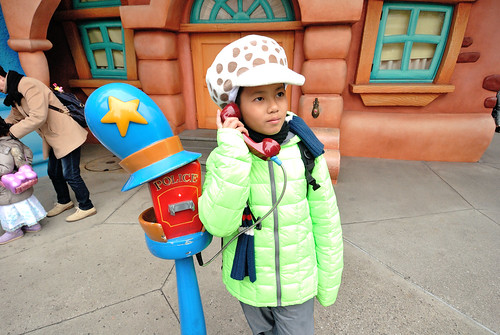
