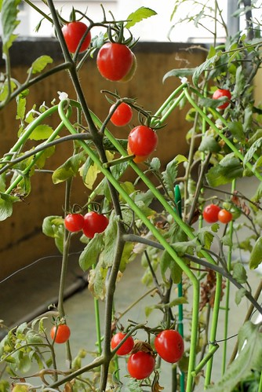

話說人當了媽後是用小孩的年紀來算日子   
小孩長越多就也代表自己老越多了...  
而當媽的又是怎麼去計算 體會 感受小孩長大了ㄋ?  
就是看著小孩從軟趴趴..到會翻會爬會走會跑..會講話會頂嘴會吵架會耍心機..  
會踏三輪車..會騎沒有輔助輪的腳踏車..追趕跑跳什麼都難不倒...  
甚至已經可以勇敢的在沒有爸爸媽媽陪同下 跟著老師同學去外地過夜旅行...  
  
真的! 有小孩後日子過很快...而計算日子的方式很簡單很顯而易見...  
  

去年10月阿徹學沒有輔助輪的腳踏車的時候   
小愛騎著小電動摩拓車在一旁湊熱鬧  
後來用奶粉累積的點數換了一輛腳踏車給小愛   
小愛明確的認知"那是她的腳踏車"  
所以即使她的腳還不長不夠有力    
只能屁股坐在椅墊上 手握著把手 腳放在踏板上的乾過癮  
她卻還是樂此不疲 ...  
哥哥上頂樓練車的時候 她的車也還是得扛上去湊熱鬧  
即使大半的時間她的車都是在原地動也不動  
即時對她來說  騎車的速度感只能在爸爸媽媽從背後推一把的時候才能享受到  
但那絕對就是她的車  誰也無法取代她這小主人的位子  
好吧...那就看你多大的興緻可以這麼坐腳踏車  看你能這樣持續多久...  
  
後來有一天媽媽熊熊發現 唉呀 小愛怎麼從這個位子跑到那個位子了  
問徹爸"你推他過去的ㄚ" 徹爸說"沒阿.."  
唉呦~莫非是小愛自己ㄊㄨ..ㄊㄨ..ㄊㄨˋ過去的ㄚ  
以她那還無法踏著腳踏板一圈的小短腳來說  這算是鴨子划水的傻勁吧  
  
後來有一天爸爸媽媽又突然驚覺  
哇 小愛已經可以恣意的從頂樓A地直線騎到B地了  
小女子苦練多時總算摸得竅門 漸漸可以享受到真正的騎車樂趣了  
  
上週兄妹倆在頂樓溜車時  看著小愛跟著哥哥一樣的繞圈子 競逐   
我跟徹爸徹底承認"這小女子真的會騎腳踏車了"  
然後我與徹爸兩人又大大的感觸了一番...怎麼時間過的這麼快阿  
懷著小愛 搬來板橋  阿徹開始ㄊㄨˋ著他的腳踏車不過都是不久前才發生的事  
怎麼轉眼間小愛也會ㄊㄨˋ腳踏車了  
阿徹ㄊㄨˋ腳踏車的時候 小愛還才在媽媽的肚子裡的ㄚ...  
真的 我真的只能說"小孩在大很快" 真的很快....   
總算小愛也可以有這種有速度感的騎車照片了   
因為她真的會騎車 真的可以享受速度感了  
  
  
  
  
嘿嘿...會騎車後 坐在腳踏車上多了許多得意的笑容  
與摸索ㄊㄨˋ腳踏車時候的嚴肅認真模樣很不一樣  
  
  
  
至於這個在媽媽記憶中還在ㄊㄨˋ腳踏車的小子早已經在不知不覺中長大了  
  
  
  
騎車對他來講早已經像是走路跑步那樣的本能動作了(只是有的人天生容易跌倒 哈哈)  
  
  
  
而小子生命中的第一台腳踏車已經快要不敷使用 功成身退了  
小子騎著不能伸直腳的腳踏車讓人感覺像是馬戲團裡騎著小小車的小猴子  
  
  
  
小愛這"一歨一腳印"  一ㄊㄨˋ一前進的學習精神讓媽媽很是感動  
(其實是爸爸媽媽之前太沒把小愛騎車這事放心上 所以才會突然有一天被驚嚇這麼多)   
  
  
只是阿...人真的有點瘦小 車子也有點輕薄不耐  
偶而轉彎過猛或是一個重心不穩就會翻車了  
沒關係 拍拍手 拍拍身上泥沙  繼續騎...  
  
  
  
開心哩..  
  
  
  
得意哩...  
  
  
  
陽光阿愛的樣子越來越顯見了...   
([http://tw.myblog.yahoo.com/world-sakura/](http://tw.myblog.yahoo.com/world-sakura/)    
 這是爸爸常看著說著"希望小愛以後也能是這樣的"陽光阿櫻)  
  
  
  
呵呵...不用當明星啦  
但真的希望小愛以後是個真誠 善良 可愛的陽光女孩  
  
  
  
看兄妹倆這麼的競速著  
我們想 小愛是該接手哥哥的車了(輪胎抓地力比較夠 而且比較重比較穩)  
而哥哥是該換台大車了(雖然小愛的小紅車有比較大 但又擔心車太爛 一個緊急煞車人不小心就彈下樓去了)  
  
  
  
望著阿徹與小愛真的會覺得有兒子真好 有女兒真好 有他們這對兄妹倆真的很好  
  
  
  
會騎車後的小愛除了開心外 也開始臭屁了  
直說"我的後面可以載人喔" 還硬要媽媽讓她載  
可是擔心"ㄎㄧㄠˋ ㄎㄡ  ㄌㄟ˙"的媽媽可是戒慎恐懼阿...  
況且這麼重的媽媽坐上去後 小愛哪還騎的動阿  
媽媽要在"不侵權"的情況下 偷偷用腳滑幾下 好讓小愛開心她在載媽咪勒   
  
  
媽媽被ㄍㄧㄥ的大腿都抽筋了  
所以還是載哥哥比較剛好啦  
  
  
  
只是在後面嫌慢的阿徹哥哥常常忍不住下腳助划 呵呵~~   
哪天真的可以去外頭 兄妹倆好好的尬尬車了...  
  
  
  
對了 那天(4/6)上頂樓最主要的目的是要整理數日未照顧的植物  
還有採收那紅澄澄成熟的小番茄  採了12顆喔...  
看到哥哥要帶番茄去給同學吃  
小愛也嚕著要拿蕃茄給他同學吃 問他同學是誰 她說"嵂嵂" 還有別人嗎 她說"沒有"  
所以她心滿意足的討了兩顆番茄 開開心心的帶去學校要跟律律一起分享  
  
至於阿徹因為12顆不夠分18個同學  
後來在Freda建議 阿徹同意的情況下 媽媽又去外面多買了一斤小番茄一起帶去學校分享  
同學說"蕃茄好好吃喔"  
還有人問阿徹"你家是住在農田裡嗎 要不然為什麼可以種番茄" 呵呵...  
  

