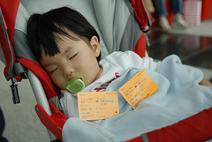

本來以為過了高鐵半價期 大概不會神經秀逗灑大錢去坐高鐵的  
但~ 年初三我真的神經秀逗了  
年初三煮著中餐時突發神經的跟徹爸說"來坐高鐵去高雄吧"  
徹爸不可置信的看著我"真假?" "真的阿"  
問了三姐一家人 興趣也頗高  
於是一夥人就這麼給他臨時出發前往高鐵嘉義站    
剛好徹伯就在北港回嘉義市的路上 於是便先行轉往高鐵站排隊買票  
其實大家純粹無聊 就算沒買到票也無所謂   
但三姊夫還是開玩笑說"沒有高雄 那就到台南 台南再沒有那到台中或新竹好了"  
徹爸說"反正就是5張有位子的票就好啦 管他去那~"  
3點鐘到達高鐵站 徹伯笑嘻嘻的拿著票對著我們招手  
大伙開心的喊"哇 真的買到啦 阿伯你好讚~"  
拿到高鐵車票當然要開心的照相留念一下  
一輩子這樣灑大錢坐高鐵的機會應該屈指可數吧  
  
    

瞧~大家拿著高鐵車票都很開心吧  
連三個小男孩也都很開心哩  
  
    
  
    
  
等待了40分鐘 總算要進閘門嚕 嗯~感應度還不算太糟  
入了閘門後 空蕩蕩與閘門外的人潮呈現強烈對比  
睡了一覺後的小愛也醒來神采奕奕的開始這趟高鐵半日遊嚕~  
  
    
  
哈~真的超像觀光客的 照個不停~  
高鐵月台跟高鐵列車進站的氣勢果然不凡  
  
    
  
坐在車內 說真的感受不到高鐵時速高達200多  
蠻平穩的 連要進站停車時也感受不到啥晃動(比台鐵跟捷運好太多)  
空間也蠻寬敞的 尤其餐桌成了打發小孩時間的玩意  
開心阿~難得搭火車的小朋友們各個興奮不已  
  
    
  
40分鐘從嘉義到達高雄左營站  
首先被左營站內的人潮有點嚇到(不輸台鐵站ㄛ)  
接著搭計程車時更被那排排停 一台接著一台的計程車給嚇到  
排隊等車時 有人問"幾個人" "9個人 兩台車"  
待幾部車同時停好又很快的指使"妳們這兩台" 然後咻的開門 人上車 關門    
吼~ 搞的大伙超緊張 好像在作戰一樣  
  
4點20分到高雄 8點20的車回嘉義 只停留4小時 因此大伙決定就去愛河畔晃晃  
  
    
  
人潮不少不過環境整齊也不像淡水老街那樣攤販擁擠   
沿途的街頭藝人水準也不差   
坐在階梯上吹著微風 聽著藝人民歌演唱感覺真的挺不賴的  
如果不是小孩不懂情趣的拼命往前衝 我們這些大人可能就這麼坐著聽歌都不想走了  
停停走走好一會 張三姐買了些薯條炸機塊慰勞小朋友們  
大家爭食的畫面很像一群餓昏的野狗(尤其張小徹貪心的抓滿雙手)  
  
    
  
    
  
    
  
晃了一會 原本打算在愛河畔找間有氣氛的餐廳大伙浪漫一下的  
但一客動輒700元以上的套餐 實在很難讓我們五個大人帶著四個小孩走進去  
最後只找了間平易的羊肉爐小吃店隨意打發晚餐  
然後回到愛河畔吃冰琪琪  
微風 音樂 冰淇淋 可愛的孩子&老公  一如往常的平凡的幸福~  
  
    
  
    
  
7點40分坐上計程車離開愛河畔  
高雄行就這麼嘻嘻鬧鬧 完全沒計劃的結束了  
半日高鐵行 嘉義高雄車票 420\*2\*2 + 左營愛河間計程車費 210\*2 +其他吃吃喝喝費用  
高鐵果然是奢侈享受阿  平民百姓只能偶發神經來一次  
不過坐過一趟 新鮮感滿足了 應該也可以免疫了吧 ~  
  
  
