前幾年痞子英雄播出時 我跟徹爸第一次驚豔於高雄的美 而這幾年高雄也真的儼然變成偶像劇城市了 很多的偶像劇都在高雄拍攝 我也曾經熱血沸騰的買了本高雄旅遊書 等著好好深入旅遊高雄... 只是這麼多年過去 還是一直停留在"想法"階段 連計劃都談不上 因為每當我跟徹爸討論到高雄 兩人的最後共識便是"城市 對於我們實在沒什麼吸引力!" 所以家裡高雄的書一直很新 而花蓮的書則快被翻爛.... 這回趁著要去澄清湖球場看球 總算可以趁機來個高雄一日行 只是我提的幾個方案都紛紛被徹爸以"這好像沒什麼"退回  徹爸甚至說"不用非得要去哪阿" 可是就我來講"順道"的機會沒好好利用 真的很是浪費說.. 所以我硬是來個半日高雄行 中午抵達岡山來個人氣小吃午餐 然後去科學工藝博物館打發看球前的炎炎午後 

走在科工館的路上時 阿徹跟小愛不約而同的說著"這裡好像之前去的國美館" "這裡是不是美術館" 我說美術館那個是在台中 而這裡是在高雄 可是兄妹倆還是嘖嘖稱奇於兩個真的長好像(蓋的好像) 還問我為什麼這麼像 我說因為都是國家蓋的博物館 所以外觀上看起來這麼像! 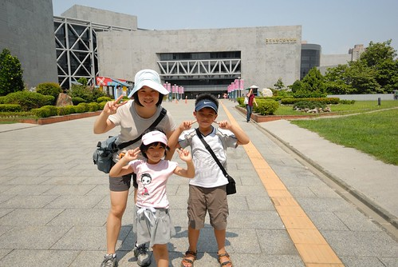 進入科工館後就被一樓大廳的天庭給驚豔 有夠高挑明亮又大器的(南部都這樣氣派嗎)  而大廳一旁的機器人也馬上吸引住兄妹倆的目光 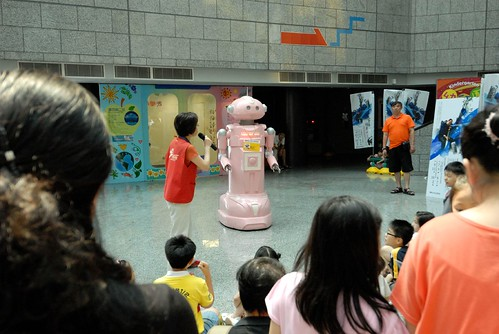 科工館應該就類似台北的科學教育館 台中的科博館 但我也完全不知道這裡到底有什麼特點跟展覽 只覺得這裡有冷氣吹 有得玩應該是很好的夏日打發小孩處.. 買好票入口處進去後 便有一些熱心的大哥哥大姐姐們招喚阿徹去體驗光纖的原理 阿母我也是第一次才明瞭了光纖的原理... 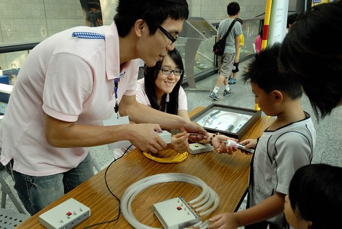 其實帶小孩出門不用貪心  所以今日在這的目標也只有兒童科學園區 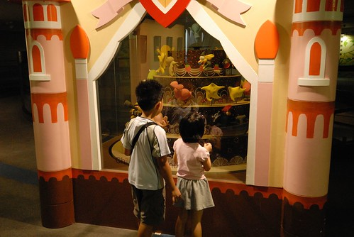 照相的時候 我只覺得這蛋糕裝置真是可愛 後來當逛完兩個主題區 打算騙小孩離開兒童區去館內其他地方時 聽阿徹講才明瞭原來這三層代表兒童區的三個主題區阿:  夢想號 奇幻國以及糖果屋  首先去的是夢想號主題區: 以船隻構成的戶外意象的展示空間，利用各種和海上生活相關的體適能檢測展品，來測試參與觀眾的肌力、肌耐力、柔軟度、爆發力與敏捷性等體能狀態。船上還有各式各樣利用風力，水力及機械裝置的體驗展品，使觀眾在刺激與驚奇的氛圍中，發現科學的神奇與樂趣。  這一區的兒童很多 而且因為有很多的體適能檢測 所以一整個蹦蹦跳跳&吵雜 而且部分的器材可能因為過度使用或是使用不當 怪怪滴... 考量每個儀器的使用時間 夢想號規定每場時間為50分鐘 每50分鐘就清場一次讓儀器休息 本來徹爸壓根不看好館方人員會徹底執行清場 但時間到響鈴響 擴音器請所有大人小孩出場  這點徹爸給予高度肯定!  接著我們去糖果屋: 考慮到學齡前兒童的需求，以經典格林童話「糖果屋」為故事主軸，建構一個感官知覺的探索空間。展廳內充滿著摸一摸、看一看、聽一聽和試一試，從視覺、聽覺、觸覺與平衡感和肢體運用等整合數種感知的向度，來提供小朋友不同的特殊體驗，在擴展生活經驗的同時，也提供小朋友探索與解決問題的機會 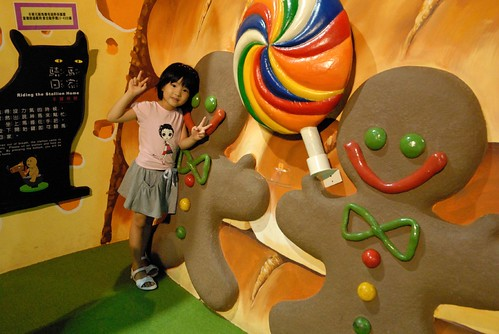 雖然阿徹已經很老 不是學齡前了 但是他在這還是玩的很開心 "偽馬力歐"之人版跑跑跳跳  相較手指彈鋼琴之雙腳"踩"鋼琴  小迷宮探索  右下角之人版萬花桶  本來應該是桶子兩邊各站一人互看的萬花筒 徹爸靈機一動把相機放在洞口照對向的人臉 所以有了我們四個人獨一無二的萬花筒照  阿徹的 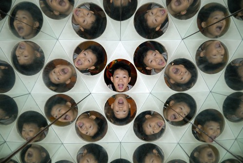 愛愛的  我的  徹爸的  很好玩也很漂亮的萬花筒照吧! 我們看著照片哇哇叫時 剛好有個媽媽經過我們身旁看到便一路興奮地跑去找他家爸爸說那裡... 呵呵 接著我們又去影像遊戲  感覺好像宋七力的顯靈照片喔!(真巧 一樣在高雄) 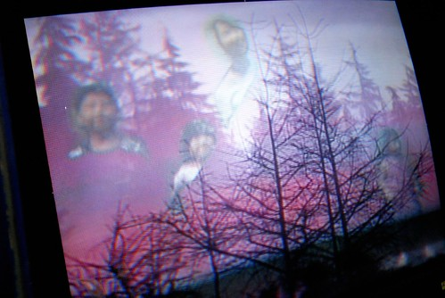 跟薑餅人和照時 阿徹調皮的假裝像是在吃大棒棒糖  而愛愛也化身為煮昆蟲濃湯的小巫婆 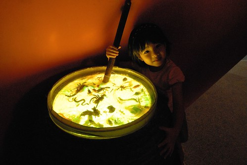 巫婆要乘著掃把飛走嚕~ 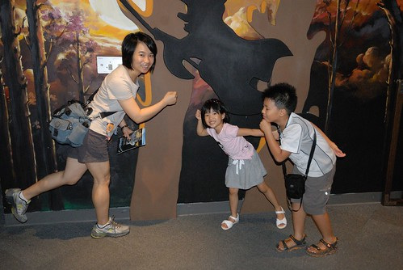 離開好吃好玩的糖果屋後 我們接著來到最後一個主題 奇幻國: 奇幻國由大耳朵精靈的魔法聲林、大眼怪的幻影村和亮亮寶貝的光之城堡組成，裡面充滿著聲、光和影像科學的神奇和美麗，大家在這裡開心的進行各種科學實驗和遊戲，調皮的設計各式各樣的關卡與謎題來考驗到奇幻國遊歷的大小朋友。但愉快的生活中也潛藏著危機，愛搗蛋的小魔怪偷偷的潛藏在暗處，觀察大家的行動，找機會要來破壞平和的這一切…… 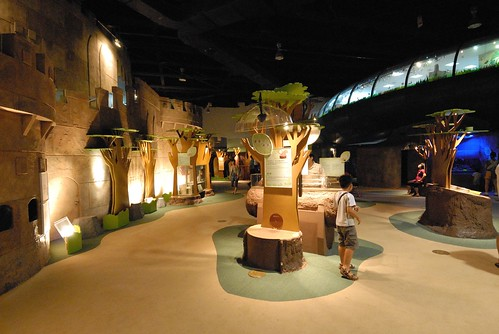 這裡真的很多光或影像的游戲及展示 充滿著美麗與神奇 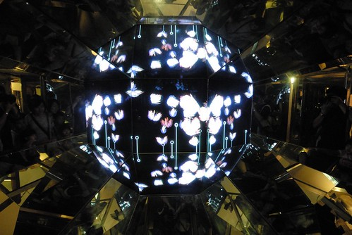 影像記錄下愛愛跳躍的連續動作  花博園區裡曾經玩的不意樂乎的影像踩踩遊戲  鏡子迷宮裡不同鏡面或折射的影像遊戲 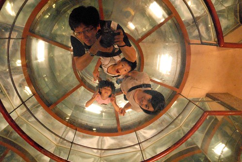 無底洞裡伸出來的魔手... 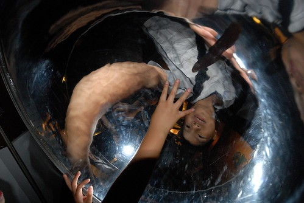 不同擺長譜出的曲條之美  聲波譜出獨一無二的沙畫  快速轉動著的動畫影像 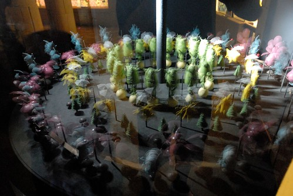 這一區很是神祕也很好玩說...  而歡樂的時光總是過得特別快 眨眼間就快到球賽開始的時間了 就這樣三個主題區便花去我們2個鐘頭的時間 到了該是離開的時候... 也就是說總共七個樓層的科工館  今日我們竟然只有逛到地下室的小小半個角落而已 Orz 下回有機會的話再來這好好逛逛 然後再看場3D電影! 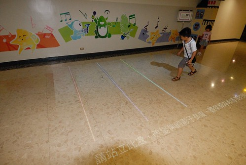 離去前 我們還照了兩張免費的3D照片 只是我一直很納悶 這樣必須拿著眼鏡(拍照還附送愛愛拿的那個眼鏡)看的3D照片 意義到底何在阿? 除了高科技以外............ 
