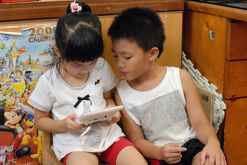

前兩週阿徹的"閱讀列車"讀書心得作業裡畫下了那當下他最喜歡....  阿徹很得意老師給他打了雙圈 且因為這樣讓原本因為寫錯答案而扣掉兩分的分數 因這雙圈加了2分而又變成100分  阿徹大笑"哈哈 我還是100分!"很是得意.... 阿徹畫圖勞作寫字啥的向來是創意足但精細度不足 大辣辣的 這張圖也一秉往來風格但很生動很寫實  看的我跟徹爸也忍不住笑著搖頭 只是兒子阿! 是Wii而非Mii 而且我們家的電視什麼時後換成輕薄的液晶電視啦.... (解析: 電視櫃電視右方為小水族箱 而左方擺放著我們母子三人的書包 依序為灰 淺藍 深藍色 )

週日晚上用NDSL打發兄妹倆時  看到兩人模樣忍不住放下拖把拿出相機來...  

看到妹妹這樣專注的看著哥哥專注的玩 真的會覺得幸好有兩個 

換妹妹玩時 哥哥也緊跟一旁隨著起伏外加技術指導 

或許這也是種兄妹革命情誼吧! 

阿徹對於妹妹的情誼不只在於玩電動 還在於幫妹妹做勞作 學校需要的柚子創意選美大賽 不勞媽媽費心 阿徹自告奮勇的從設計到製做 直至最後的閃亮亮眼睛充分表現出阿徹對公主的想望期待 至於媽媽只要負責黏膠帶 而愛愛則只要動嘴說 要什麼顏色 要這個 不要這個... 

閃亮的不只是公主 阿徹學校做的手偶皮卡丘也是超級"閃"的啦 眼睛水汪汪 

雖然常會嘮叨阿徹又去哪的回收桶撿了哪些垃圾回家  成天亂做東西把家裡弄得亂七八糟 但其實還蠻折服阿徹這些鬼主意以及勇於表現自己創意的勇氣 (阿徹你胖了喔 有雙下巴了.........) 

這個週末裡戴在手上的戒指當然又是他的最新力作-- 火影忍者裡"曉"組織的手戒 他自創的寫了個"空" 讓我很懷疑指的是他最近很愛看的西遊記裡的孫悟空 但他不承認只是笑... 還成天追問著我要漫畫上的 玉, 白, 青, 北還是南... 我說我要"中"  我喜歡中庸之道 可是阿徹說沒有這個 一直不肯做"中"給我 

雖然我是個不太信星座的人 但我百分之五十認同阿徹是隻魚  有點浪漫有點多愁善感 每次他的半番期被我們盯的慘時 常會憂鬱的說著"我不喜歡自己" 小憂鬱的讓我總忍不住摸好多下他的頭 或是給他個大抱抱 只是阿...每次憂鬱過後還是老毛病不斷 讓徹爸也會忍不住跟他說 "不要每次被罵後只會傷心難過 說不喜歡自己 能夠改過才是重要" 或許我們該竊喜的是 起碼他對於我們責罵的話還有懺悔還會傷心 但懺悔過後的實踐力才是考驗才是學習阿!!! 有天我煮完晚餐後才發現阿徹一個人靜靜的在遊戲區好久 原來是在做這件事 

"我不喜歡自己" 強烈且充分的表達出他的生氣 他的沮喪 他的Blue 爸爸說"這也是成長的一部分"   原來成長的過程是這樣的酸澀阿.... 不過講真的 每次看阿徹天真開心的樣子(而且還是大半時後)真的很難想像他blue的樣子 我覺得他開心的時候應該也壓根忘記他懊惱傷心的心情吧 偶而他心情好時 我會故意鬧他"你這模樣根本不像討厭自己的人"  他害羞笑著回應我.. 最近問他"你最近還會不喜歡自己嗎"  阿徹想了想說"有比較沒那麼不喜歡自己了" 兒子阿! 我相信你本質上是很喜歡自己的  就如那樣喜歡你的媽媽你的妹妹那樣 沒事就別太"魚" 太無病呻吟了...好好過日子比較實在點..... 
