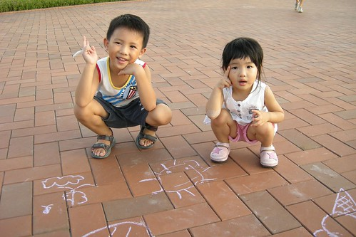

真不敢相信愛徹家竟然可以在家宅這麼久... 五月初從花東玩回來後 愛徹家的週末不是在窩在家就是在嘉義或是新莊阿公家 連住家附近的公園或是啥賣場一步也沒去過 直到八月底同學小吳一家三口來台北作客我們才"再"踏出家門去"玩" 之所以會這樣最主要的原因應該是家裏那個愛玩又愛計畫玩的媽媽徹底在休息 所以週一到週五都趴趴造的媽媽在週末就不愛出門了

講真的我跟徹爸還真不知道台北有啥好玩的 想了老半天最後竟然也是帶人家去其實自己好奇很久的鶯歌陶瓷博物館 每次如果從三峽上下二高經過陶瓷博物館時都會很好奇裡面到底有些什麼 不過所謂越是垂手可得的東西越是不積極 嚷了這麼多年最後我們還是因著小吳一家子才去探訪

講真的博物館內的陳設展覽還頗令人失望的 但戶外的廣場倒是很令人驚豔 尤其傍晚時分 微風徐徐讓人一整個心曠神怡

那天去鶯歌前還先去了新莊IKEA逛逛 見識到了新聞上上說的不景氣中的超夯賣場餐廳 我一直覺得IKEA的餐點不論排盤或是口味都不甚精緻及可口 可那人潮卻真的給他非常的恐怖 光是要點餐就要排隊等他20分鐘 不過最難的還是找位子 要懂得locate then wait....  

小吳一家子三口...(幸好他們滿載而歸 載回滿滿一車的貢品)

難得的同學合照

徹爸八月生日所以可以免費入館 (台北縣民在生日月可以免費暢遊各台北縣博物館 )

館內真的很寬敞高挑 但卻益加讓人對其内的展覽感到空虛與失望

作品少的讓人懷疑真的只有這樣嗎.. 而最令人"驚豔"(其實是訝異)是用數個馬桶擺設的作品 還真不該如何形容那當下的感受 只能說也許自己真的太沒藝術天份了

這是仿造磚廠...聲音轟巄轟巄的是最像的地方

這...這...鸚鵡嗎...

整個館內唯一讓我最有感受的就這長梯跟天棚 四面滿滿的陽光灑入很舒服 很難得的可以吹著冷氣的同時享受著豐富的陽光

館內晃不到半小時好像就差不多看完了 於是來到館後方的廣場上 不走則已越走越讓人驚喜  總算覺得這趟來的有點價值了

很裝模作樣的兄妹倆 只是兩人裝的氣質是一整個不一樣

即使披頭散髮也要裝文靜的小愛

進入戶外後映入的第一眼景象 只有這樣嗎? OH No...後面有超乎想像的寬廣

只是廣場內的陶瓷作品也不是太多與太優(作品感覺都不夠大器) 還是讓人小小失望一下

掉在地上的冰淇淋... 唉... 也許是想表達"生活中"的藝術吧 不過真的很像"那個"耶!!!

左下方的作品是什麼? 猜猜看...

不是小丑魚住的海葵啦                         是地毯... 又一個令我不知如何形容心情的作品 這些真的都跟我印象中鶯歌老街裏看的 賣的東西太不一樣了

不過總算..總算...看到一個大器的東西了 可以讓人下去踩水戲水的水池 (如果水再深一點 噴水柱再多一些會更大器的)

上圖中上方的那個洞進去是沙坑 而且有很多玩沙的工具 玩沙玩一玩後來踩踩水 然後再去玩沙 再來踩水  小孩應該很愛的遊戲 只是苦了顧小孩的大人 要走走去 而且這樣衣服會夾帶更多難洗的沙子阿...

難得的四人全家福 感謝小吳同學 (媽媽 今天的氣色怎麼一整個不好阿 果然像在家呆久的黃臉婆)

在戲水池旁休息了半個小時後 本來以為園區應該就這樣了  都打算回家睡覺好些 幸好徹爸說他要再去後頭晃晃 然後10分鐘後很開心的打電話call張阿徹"後面有可以做陶土的地方喔" 哈~哈~ 當初媽媽騙阿徹來這的理由總算成立了 "那是陶瓷的博物館 應該可以用泥土做東西喔"

原來暑假期間剛好有活動 當地的藝術家們會支援舉辦相關手拉胚 陶土製作等活動 阿徹在老師的指導下倒漿入模

等待...等待...

(數十分鐘後) 將模內多餘的泥漿倒出 繼續等待...等待...

(數十分鐘後) 脫模取出

繼續等待...等待.... (老師說反正不用錢 材料都是主辦單位出的 所以讓阿徹帶了好多個成品回家)

濕潤狀態的成品 (其實覺得這模樣比乾了後的水泥色還漂亮)

等成品乾了後可以拿泡棉沾些水把一些邊邊角角磨的圓潤漂亮些的 但我們急於回家都只有懶惰的用手把邊邊摳掉而已

往回走的路上看到某處有人在地方畫圖 而且有很大隻的粉筆可以使用 於是又蹲下來塗鴉嚕

(熱氣球..蝴蝶..白雲...)

在博物館的一下午 這時候最開心

小愛也加入塗鴉的行列  畫了一個方臉大太陽 然後一家子踏著餘暉滿意的回家嚕

後記.... 因為礙於時間(師傅5點結束活動) 所以阿徹們只挑了最小最易乾的小狗做 但媽媽實在很喜歡三隻小豬系列 且活動就只剩下接下來的最後一個週末 於是下一個週六我們又來了

這回跳過館內 直接由側門進入後方的戶外園區 而且這次佩姨也一起來當瑪莉亞

徹爸不負所託的做了三隻小豬 阿徹小愛則是開心的玩了水玩了沙 (上回沒帶衣服 所以不准下水)

徹爸 vs.可愛的小猴子

YA! 這個夏天總算來了講了好久的鶯歌陶瓷博物館 尤其是在暑假的最末...恩...很好的Ending...

