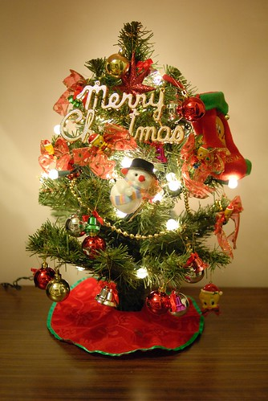
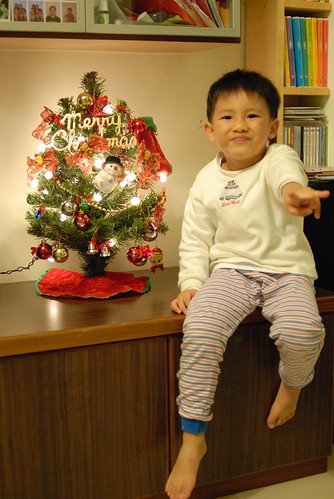
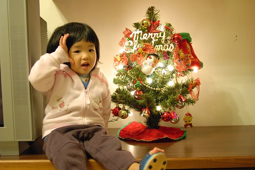
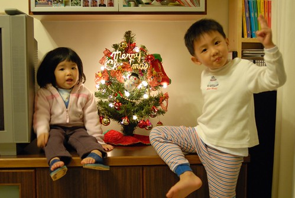
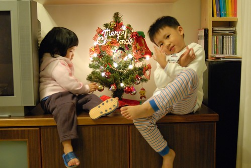
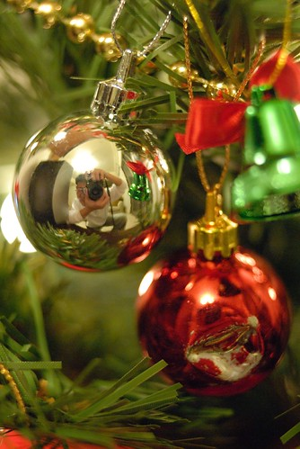
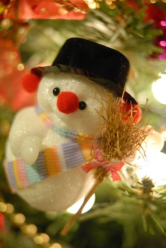

  
  
阿徹常掛在嘴邊問"聖誕節要到了沒"的聖誕節總算快要到了  
從11月底阿徹就在書店 路邊嗅到聖誕節的味道  
每天總是很High的問我 "聖誕節要到了對不對?我們可以點亮聖誕樹了嗎?"  
很難讓他理解還有一個多月那麼長  一個月是多麼長  
乾脆跟他說"要到12月才可以拿出聖誕樹"  
阿徹又問"那明天是聖誕節了嗎" (阿徹的數字 時間概念真的不太好)  
為了斷了他的殘念 我說"等學校有聖誕樹了 那家裏的就也可以拿出來了"  
果然12月的第一個上學天 12/3  學校就被妝點的充滿聖誕氣息  
所以我們家的小聖誕樹也得以從儲藏室裡拿出見天日嚕~  

那天阿徹迫不及待的想要趕快放學回家  
甚至要求晚餐要吃麵線就好  (因為吃麵線可以很快就吃完  不像吃飯那樣花時間)  
可惜他打的小聰明被我識破   所以晚餐一定得吃飯  
阿徹在便當店不解的發起脾氣 直說"為什麼不能吃麵線"   
我說"那要不要喝奶最快 1分鐘就好 就可以去做自己的事了"  
阿徹不回應  垂著淚直說"我要趕快裝聖誕樹"  
甚至突然迸出了一句"你們都對妹妹比較好"   (關於這媽媽又說了一大堆大道理 另述)  
我也在想為什麼我這麼堅持阿徹今天不能吃麵線  
用麵線打發晚餐  然後讓他開開心心的趕快去裝聖誕樹應該是最省事的  
原因有 1. 阿徹前兩天去動物園時才因為堅持的只要去看他想看的貓頭鷹搞的大家啥也沒看的就回家   
             2. 晚餐不該基於這種原因被隨便打發的  
             3. 這是對他的考驗  
幸好阿徹在媽媽發表了一番"你比較喜歡愛生氣的小孩 還是不愛生氣的小孩"的道理後  
修復了他斷掉的筋 若無其事的開開心心回家 洗澡  吃飯飯  
然後等爸爸媽媽也吃完飯 洗好碗  一切搞定後   
"闔家同歡"的妝點我們的小聖誕樹  
  
  
  
小愛的第三個聖誕節了 但第一次參與體會聖誕節  
小手小心翼翼的掛上小球球 小鈴鐺  
  
  
  
OHYA~聖誕節正式開跑  
   
  
  
阿徹期待已久的聖誕禮物就快到手...  
  
  
  
其實不過是棵小小的聖誕樹  但讓人感受到濃濃的年節氣氛了  
聖誕節  元旦 冬至 農曆過年... 哇 真的快要過年了  
  
  
  
受阿徹影響 今年我也好想有個聖誕節禮物喔  
可是要什麼禮物ㄋ 好難...  
還是小孩子簡單幸福 滿滿的 容易達成的期待與願望  
  

