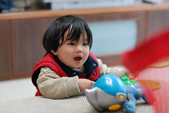
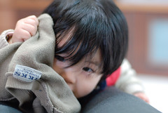
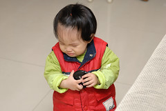
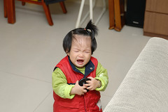
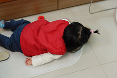

最近問小姑娘 "要不要"時 偶會點頭表達意見  
甚至會用點頭表達她對於食物的滿意  
昨晚當我跟阿徹吃完晚餐要下桌時  
小姑娘又在她的餐椅上一附不想離開的樣子  
我問她"吃飽了 要不要下來了"  
小姑娘竟然微笑著搖了搖頭  
哇塞~竟然會搖頭了   
為娘我驚喜之外 更是多了份"戒慎恐懼"  
心想"完了 以後唬不得騙不得了 "  
會搖頭表示真的開始思考 開始咀嚼人家說的話 然後做出自己的決定  
要開始跟她講道理 再也不能隨便我了....  
  

相較於阿徹 小愛的情緒算是比較平穩  
而且比較"長眼"  
就是說當人家在念他時 會明白體認人家在說她  
常常聽著聽著就抿起小嘴 眼框漸漸盈滿淚水  
  
  
  
偶而情緒失控 才會放聲大哭起來  
然後反倒是大人要去安慰她 沒有罵她啦  
  
  
  
不過偶而還是會耍番的 躺在地上哭  
沒人理她 哭了好一會後 再自己爬起來裝作若無其事的繼續玩耍  
  

