徹媽的近況可以用柳暗花明又一村來形容吧 轉了個大彎似乎回到了原點 但自己心理明白這一路的起承轉合 歸根究底還是得歸咎於自己的任性 但幸運的是生命中一直有貴人相助 雖然依然不是朝著大事業 大賺錢的方向邁進 甚至背道而馳了 但衷心感謝所有支持 成全我的人 讓我可以繼續任性的依著自己的心意過日子....

好心情 好氣氛就來寫篇遊記紀念一下吧  哈哈哈~~~

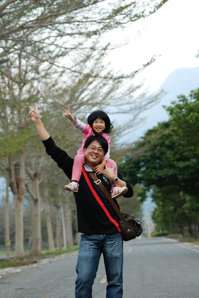

其實在龍田社區待的沒有很久 也沒有很深入的認識當地著名的日本移民村 所以上網找了幾段有關台東鹿野的介紹  讓大家對此地多些了解....

台東鹿野在日據時期是個日本人規劃的移民村，河階平台上的龍田村平坦開闊，道路從當時就規劃為井字形，近10幾年的小葉欖仁樹長個茂密，形成一條條綠色隧道，騎單車逛鹿野，甚至還玩出騎單車躺大馬路的玩法，由永安社區推動的鐵馬活動，在此逐漸形成固定的地方特色。

位於台東縣鹿野鄉龍田村是騎自行車的好所在，除了風景怡人外，由以「龍田之子」自居的阿度先生親自帶領的單車導覽，更能說明龍田的特色與資產所在，內容不但深度且多元，活潑生動的講解趣味，也讓遊客進一步認識到龍田村為何又稱「移民村」的意義，還有證嚴法師帶髮修行的第一位駐息地等人文，全程7．2公里，騎一趟下來約1.5小時，但時間就在這邊學邊玩中悄然度過。 沿途可見造山運動、河階台地等自然景觀，尤其是立在半山腰的舊河道遺跡，令人不禁感歎大自然造化。古老完整的日式建築、證嚴法師駐息地崑慈寺，皆是此地有名的景點，沿路有1公里的小葉欖仁綠色隧道，徐徐涼風搭上蔭涼樹蔭，鳥叫、蟲鳴，甚至體驗躺在馬路上，都叫人新鮮且心曠神怡。 -------------------------------------------------------------------------------------------------------------------------------

看了這些介紹是不是覺得龍田很有人文氣息以及愜意阿  因此我們當然也趁這回去拜訪了龍田 不過因為是自己亂亂騎 少了導覽介紹  老實講對於文化部分的體驗很難深入 主要騎乘 留連的地方就是那長達一公里的小欖仁樹綠色隧道 講到這忍不住想抱怨一下 導覽真的不用限定要多少人以上的團體啦 要不然像我們這種非假日來的小家庭真的只能自己亂亂逛  折扣打很大哩...

龍田字型車道的風行是一個外來移民的阿度所推廣出來的 我很好奇也很佩服為什麼一個外地人可以這樣愛這麼一個地方 甚至就這麼開啟了他的事業 還有當地的新氣象 我想除了有過人的勇氣跟智慧外 一定更有著異於常人的一顆心還有生活價值吧

雖然佩服阿度歸佩服 不過得小小抱怨一下那個車子沒有太好騎說 呵呵

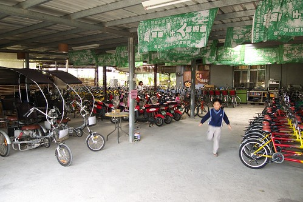

愛愛堅持要坐前面的車子 所以媽媽得張開雙腳用著難看的姿勢騎車 加上車況不佳 短短幾公里騎下來還挺折騰人的

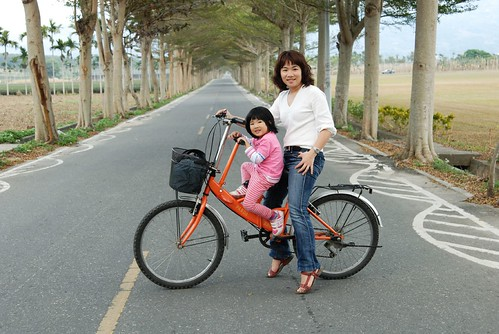

而找不到適合童車的阿徹則是跟徹爸騎雙人協力車 原本很抗拒騎協力車的阿徹 第一次騎協力車後就喜歡上這讓人齊心合力的協力車

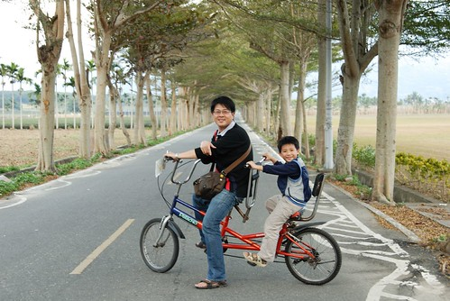

龍田社區的道路果然如日本般的方整整齊 尤其綠色隧道那段 筆直長長的似乎看不到路的盡頭

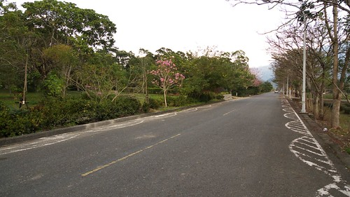

去年的夏天這舉辦了個萬人躺馬路的活動  讓遊客不只騎著感受綠色隧道也能躺著感受這裡的綠樹藍天 不過因為現在是冬天枝葉並不茂盛  反而是另種美景

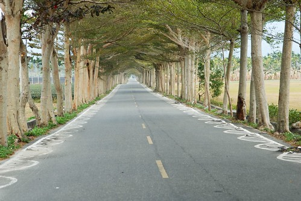

原本報與很高期望的徹爸似乎頗為失落 相機拿的意興闌珊 可是徹媽還挺愛這種蕭蕭然的感覺  所以這回就由我掌鏡啦

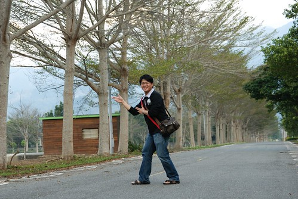

難得徹媽很滿意自己拍的照片 覺得下面這一系列的徹爸小愛照片fu都很好

之一 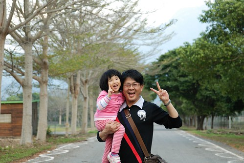

之二

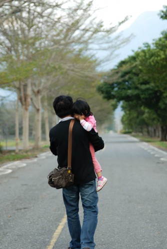

之三

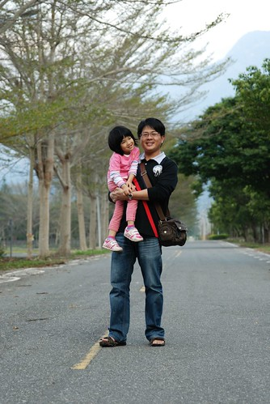

之四

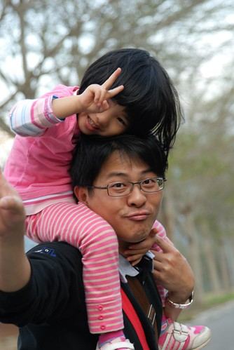

之五

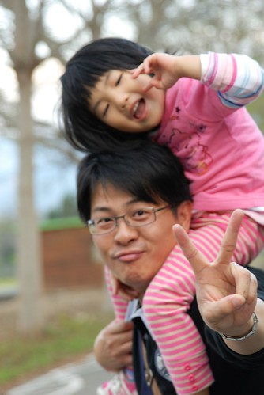

之六

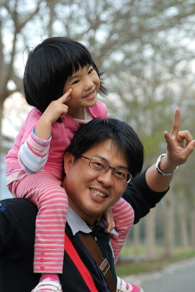

之七

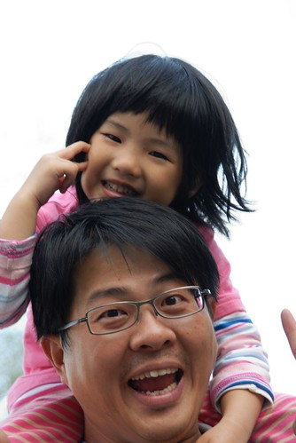

之八

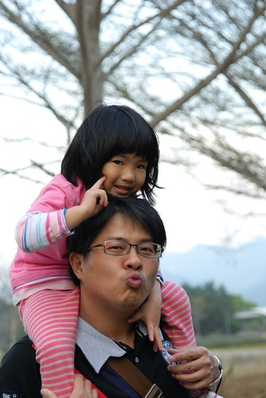

徹爸說難得我會這麼有興致 拿著小兩拍這麼多照片 呵呵~ 看著鏡頭裡可愛的小愛身影 最後媽媽也忍不住央求要跟小愛來合照幾張

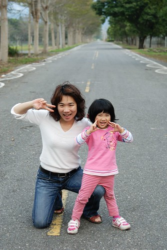

媽媽沒有爸爸好肩力 所以只能這樣站著照...

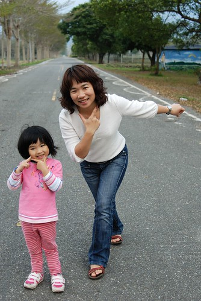

天快黑了 騎完綠色隧道我們便準備收工了  回程換爸爸載小愛培養感情

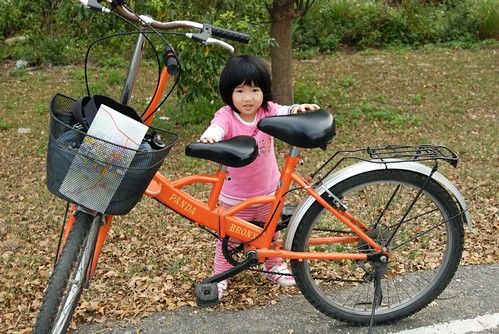

而我則是換讓阿徹兒子孝順嚕~

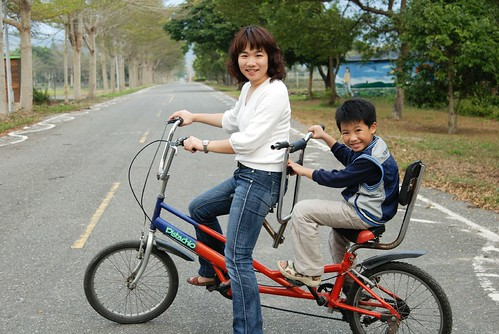

哈~好像是篇沒有尾巴的遊記  不過這篇真的純照片分享ㄇㄟ....
